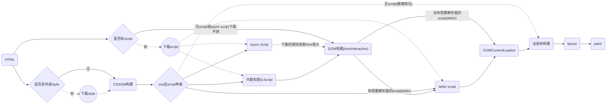

# 页面性能

[RAIL](https://developers.google.com/web/fundamentals/performance/rail?hl=zh-cn) 是一种以用户为中心的性能模型

延迟与用户反应

* 0 - 16ms: 人们特别擅长跟踪运动，如果动画不流畅，他们就会对运动心生反感。 用户可以感知每秒渲染 60 帧的平滑动画转场。也就是每帧 16 毫秒（包括浏览器将新帧绘制到屏幕上所需的时间），留给应用大约 10 毫秒的时间来生成一帧。
* 0 - 100ms: 在此时间窗口内响应用户操作，他们会觉得可以立即获得结果。时间再长，操作与反应之间的连接就会中断。
* 100 - 300ms: 用户会遇到轻微可觉察的延迟。
* 300 - 1000ms: 在此范围内，延迟感觉像是任务自然和持续发展的一部分。对于网络上的大多数用户，加载页面或更改视图代表着一个任务。
* 1000ms+: 超过 1 秒，用户的注意力将离开他们正在执行的任务。
* 10000ms+: 用户感到失望，可能会放弃任务；之后他们或许不会再回来。

关键指标:

* 输入延迟时间（从点按到绘制）小于 100 毫秒。
* 每个帧的工作(拖动的持续阶段, 从 JS 到绘制）完成时间小于 16 毫秒。
* 主线程 JS 工作分成不大于 50 毫秒的块。
* 加载页面可以在 1000 毫秒内就绪。

## 加载

### 优化内容效率

* 懒加载
* 压缩
* 图像优化
* 网页字体优化
* TCP 的 first roundtrip 只能发 14KB, 所以尽量将文件限制在这个大小

### HTTP 缓存

2016-02-24

* 本地缓存阶段, 当满足条件时, 浏览器直接使用本地副本,不会发送任何请求, `Cache-Control`优先级高于`Expires`
  * Cache-Control (http1.1)
    * `max-age`
    * `no-cache` 不缓存过期资源
    * `no-store` 永远不缓存
    * `public` or `private` (如果为 private 则中间缓存(CDN)不可以缓存)
    
  * Expires (缓存到期的绝对GMT时间)
* 协商缓存阶段, `ETag` 优先级 高于 `last-modified`, 如果成功命中则会返回 304 Not Modified
  * `ETag` (http1.1)
  * `last-modified` (http1.0)
* 服务器(中间)缓存
  * CDN
  * Combo服务

> [imweb.io](http://imweb.io/topic/55c6f9bac222e3af6ce235b9)
>
> [alloyteam](http://www.alloyteam.com/2012/03/web-cache-2-browser-cache/)
>
> 图解HTTP

#### chrome 里 Cache-Control 的测试

* 浏览器前进和后退的过程当中 html 是缓存的(忽视以上策略), 可以在前进后退的请求头里看到以下信息, 说明没有真正的发出请求

进入 `chrome://net-internals/#events`, 可以在 URL_REQUEST 看到以下信息

* 在浏览器地址栏输入新 url 如果和当前 url 一样, 且该 url 已经被请求过且设置过max-age(有缓存), 则浏览器会主动发出 `Cache-Control: max-age=0`

### 离线化

* ServiceWorker
* Local Storage
* HTML5 的manifest离线机制

### 加载顺序优化

* Parse HTML(show in dev tools): DOM 树构建
* Recalculate Style(show in dev tools): CSSOM 树构建
* DOM 树与 CSSOM 树合并后形成渲染树

* 当 HTML 解析器遇到一个 script 标记时，它会暂停构建 DOM，将控制权移交给 JavaScript 引擎；等 JavaScript 引擎运行完毕，浏览器会从中断的地方恢复 DOM 构建(js在何处插入，就在何处执行)
* 同样 js 也会阻塞 CSSOM 的构建, 因为他会查询或者计算任何对象的 style
* CSS 会阻塞 CSSOM 从而阻塞渲染树构建(非 dom 树, 所以外联css不会阻塞 domContentLoaded)

* [避免使用 @import css](https://www.qianduan.net/high-performance-web-site-do-not-use-import/)

> [Deciphering the Critical Rendering Path by Ilya Grigorik](https://calendar.perfplanet.com/2012/deciphering-the-critical-rendering-path/)

#### Navigation Timing API

* domInteractive 表示 DOM 准备就绪的时间点。(DOM tree ready)
* domContentLoaded 一般表示 DOM 和 CSSOM 均准备就绪的时间点。
  * 如果没有阻塞解析器的 JavaScript，则 DOMContentLoaded 将在 domInteractive 后立即触发。
* domComplete 表示网页及其所有子资源都准备就绪(包括图片资源)的时间点。从这里开始浏览器右上角的菊花将会停止
* loadEvent：domComplete 后会立即触发, 作为每个网页加载的最后一步，浏览器会触发 onload 事件，以便触发额外的应用逻辑。

#### async && defer

* 使用 async 标签可以使 js 在下载过程中不阻塞 DOM构建
* 使用 defer 可以在 async 的基础上即使 js 下载完成了也不阻塞 DOM 构建
* 使用 defer 标签不会阻塞 domInteractive, *但会阻塞 domContentLoaded*
* 使用 async 标签在*通常的下载的速度下*不会阻塞 domInteractive 与 domContentLoaded
* script created by `document.createElement` is async script
* DOMContentLoaded 和阻止渲染是两个概念, 不要混淆了

> [Page lifecycle: DOMContentLoaded, load, beforeunload, unload](http://javascript.info/tutorial/onload-ondomcontentloaded)
>
> [whatwg's HTML Living Standard](https://html.spec.whatwg.org/multipage/scripting.html#attr-script-defer)

首屏关键路径

* 不是每次dom 构建后都需要 paint(如果啥都没变为啥要呢..), 有可能在 dom 构建完成(DOMContentLoaded)前先 paint 过部分 dom 了
* 当渲染事件远小于script下载时间, 浏览器会选择先 paint 出已经 parse 的 html 部分(貌似也需要script标签在文档尾部?!)
  * 机器性能好的时候(pc)
  * script下载很慢的时候(不在本地)
* parse html 的时候即使没有 parse 到外部 js 的部分也会开始下载?!

### 首次有效绘制(FMP(First Meaningful Paint))

Paint that follows biggest layout change(视口内)

> [Time to First Meaningful Paint](https://docs.google.com/document/d/1BR94tJdZLsin5poeet0XoTW60M0SjvOJQttKT-JK8HI/view?hl=zh-cn)
>
> [PageSpeed 规则和建议](https://developers.google.com/web/fundamentals/performance/critical-rendering-path/page-speed-rules-and-recommendations?hl=zh-cn)

## 渲染

* Time to First Meaningful Paint(FMP): 首次有效绘制, 可确定用户感觉到页面主要内容处于可见状态的时间

### 像素管道(pixel pipeline)

浏览器绘制的过程由以下5个步骤组成: javascript -> style(样式计算) -> layout布局 -> paint绘制 -> composite合成

其中 layout 和 paint 会根据需要省略

### 优化 JS 执行

* requestAnimationFrame 保证 JavaScript 在帧开始时运行
* 大型任务分割为微任务( micro-tasks), 并且在每帧的 requestAnimationFrame 处理程序
* 慎用微优化(忽略js 方法间的性能差距, 因为他们微乎其微...)

### 优化 CSS 计算

* `:nth-last-child` 这种要慎用

### Layout(布局)

* 在 Firefox 中称为自动重排(reflow)

常见的触发重排的地方:

* 对“geometric properties(几何属性)”的更改
  * 盒子计算(`clientTop`, `offsetTop`, `getBoundingClientRect`)
  * 滚动(`scrollTo()`, `scrollTop`, `scrollHeight`)
  * 获取焦点(`elem.focus()`)
  * `window.getComputedStyle`(通常会)
  * 计算点击事件位置

* flexbox 可以减少 layout 时间
* 避免强制同步布局(更改样式后马上获取布局值)
* 避免布局抖动(循环内反复获取和修改)

* [FastDOM(自动为您批处理读取和写入)](https://github.com/wilsonpage/fastdom)

> [Alon's Blog](http://jinlong.github.io/2015/09/30/what-forces-layout-reflow/)

### Paint

* 除 transform 或 opacity 属性之外，更改任何属性始终都会触发绘制

> [CSS Triggers (layout, paint, composite)](https://csstriggers.com/)

### Composite(合成)

合成是将页面的已绘制部分放在一起以在屏幕上显示的过程

* `will-change` 可以单独创建新的合成器层(但是不要创建太多了), 并提前警示浏览器即将出现更改
* `transform: translateZ(0)` 旧浏览器里可以用

> [浏览器渲染详细过程 by Chuck Liu](https://chuckliu.me/#!/posts/58ea6af15dc1822fa9a57274)

### 用户输入处理

* 输入的时候避免长时间和样式更改的语句, 使用 requestAnimationFrame

> [浏览器前端优化 by Alon](http://jinlong.github.io/2017/05/08/optimising-the-front-end-for-the-browser/)
>
> [浏览器的工作原理 by Tali Garsiel and Paul Irish](https://www.html5rocks.com/zh/tutorials/internals/howbrowserswork/)

## 工具

### Lighthouse

一个开源的自动化工具，用于改进网络应用的质量, 更倾向于用户的感知(users perception)

Chrome 60 后已经默认在 audits 标签里了

It’s an improved “Pagespeed Insights

* First meaningful paint
* [First Interactive](https://developers.google.com/web/tools/lighthouse/audits/first-interactive)
* [Consistently Interactive](https://developers.google.com/web/tools/lighthouse/audits/consistently-interactive)

* [headless use](https://github.com/GoogleChrome/lighthouse/blob/master/docs/headless-chrome.md)
* [根据 json 生成 html](https://github.com/GoogleChrome/lighthouse/blob/master/docs/hacking-tips.md#iterating-on-the-v2-report)

> [使用 Lighthouse 审查网络应用](https://developers.google.com/web/tools/lighthouse/?hl=zh-cn)

### Pagespeed Insights

### WebPageTest

> [Page speed optimization](https://varvy.com/pagespeed/)
