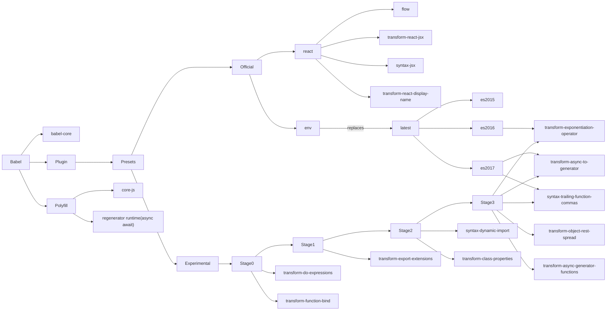

# Babel

* [Babel 6: loose mode](http://www.2ality.com/2015/12/babel6-loose-mode.html)
* preset : an array of babel plugins
* `retainLines`: 输出保留行号

Stage Presets 在 babel7 里被[废弃](https://babeljs.io/blog/2018/07/27/removing-babels-stage-presets)了

以下显示的是2018-5-10 的情况, stage 里包含的 plugin 会根据时间变化



* [Env preset](https://babeljs.io/docs/plugins/preset-env/)(包含了 babel-preset-latest, 设置好对应的 `.browserslistrc` 就可以了)

* TODO babel7 里的情况

## Polyfill

如果一个新特性你可以用ES5实现，那么应该用 [babel-polyfill](http://babeljs.io/docs/usage/polyfill/). 反之则使用 transform(不是 transform-runtime!!!)

Polyfill 的实现例子有

* Async functions, Generators
* Promise
* Object.assign
* Array.prototype.includes
* Array.from

* [transform-runtime](http://babeljs.io/docs/plugins/transform-runtime): babel-polyfill 的 plugin 形式

## babel-register

可直接食用，不再依赖一些打包工具

> [babel-register](https://babeljs.io/docs/usage/babel-register/)

* [ignore non-js files with babel/register](https://stackoverflow.com/questions/33324435/how-to-ignore-non-js-files-with-babel-register)

## Plugin 书写

* [Babel 插件手册](https://github.com/thejameskyle/babel-handbook/blob/master/translations/zh-Hans/plugin-handbook.md)

### AST

> [AST Explorer](http://astexplorer.net/)

一个节点可以用一下接口的 json 格式表示

```javascript
interface Node {
  // 节点类型
  type: [File, ExpressionStatement, FunctionDeclaration, Identifier, BinaryExpression],
  // 位置属性
  start,
  end,
  loc,
}
```

### 处理步骤

* 解析
  * 词法分析: 字符串 => 令牌流
  * 语法分析: 令牌 => AST
* 转换: 转换 AST
* 生成: AST => 字符串, 并可添加 source-map

* 访问者

### API

* babylon: babel 的解析器
* babel-traverse: 负责控制 AST
* babel-types: just like lodash for babel
* babel-generator: AST => 源码(字符串)
* babel-template: 通过模版生成字符串代码

## Babili(babel-minify)

> [babel-minify Plugins(Minification)](http://babeljs.io/docs/plugins/#minification)