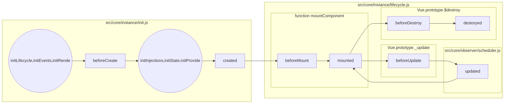
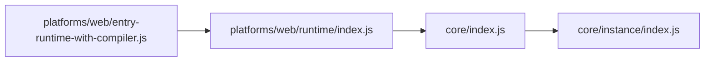

# Vue

以 `_` 或 `$` 开头的属性 不会 被 Vue 实例代理(proxy)，因为它们可能和 Vue 内置的属性、 API 方法冲突

## vs React

既然是先接触的 React，那么最开始进行这样的比较也就理所当然了。。以下箭头前面是 vue, 后面是 React

data => state

props => props

`<slot>` => 类似 props.children

mixins => mixins

`functional: true` => 函数式声明组件

父子组件的关系可以总结为 props down, events up


## 全局配置

* [ignoredElements](https://cn.vuejs.org/v2/api/#ignoredElements): 定义需要忽略的自定义元素列表

## 全局 API

* Vue.nextTick(callback): 在下次 DOM 更新循环结束之后执行延迟回调(基于 Promise 或 ~~MutationObserver(不支持 Promise 的时候)~~)。在修改数据之后立即使用这个方法，获取更新后的 DOM。
  * [v2.5](https://github.com/vuejs/vue/commit/6e41679a96582da3e0a60bdbf123c33ba0e86b31) 开始 nextTick 去掉了 MutationObserver, 增加了 [MessageChannel](https://developer.mozilla.org/en-US/docs/Web/API/MessageChannel) 实现
  * v2.5.2 后抽出了一个单独的[文件](https://github.com/vuejs/vue/commit/4e0c48511d49f331fde31fc87b6ca428330f32d1#diff-9ddd49414faddc237ff7c47aedcb12ff)来实现, 并添加了 [withMacroTask](https://github.com/vuejs/vue/blob/v2.5.2/src/core/util/next-tick.js#L81)函数来判断是要使用 MarcoTask 还是 MicroTask
  > 在 Vue 2.4 之前的版本，nextTick 是基于 micro task 实现的，但由于 micro task 的执行优先级非常高，在某些场景下它甚至要比事件冒泡还要快，就会导致一些诡异的问题，如 issue #4521、#6690、#6566；但是如果全部都改成 macro task，在 state 的变化刚好在 transitions 导致的 repaint 之前时会有问题，如 issue #6813。所以最终 nextTick 采取的策略是默认走 micro task，对于一些 DOM 交互事件，如 [v-on 绑定的事件](https://github.com/vuejs/vue/blob/v2.5.2/src/platforms/web/runtime/modules/events.js#L48)回调函数的处理，会强制走 macro task。
  * 修改后 nextTick 的执行时机总得来说相对延后了
> [Vue nextTick 源码解读 by Lxxyx](https://lxxyx.win/2016/09/25/2016/Vue-nextTick-%E6%BA%90%E7%A0%81%E8%A7%A3%E8%AF%BB/)
* Vue.component(): 注册或获取全局组件

## 选项

### 数据

* data
* props
* propsData
* computed(计算属性)(Swift?!!!) <=> watch(观察者)
* methods
* watch

### DOM

* el
* template
  * 直接使用字符串生成 dom, 如果 Vue 选项中包含 [render](https://cn.vuejs.org/v2/guide/render-function.html) 函数，template 选项将被忽略。
* render(createElement) 函数
  * 可以被理解为主要在没有 complier 的情况下使用(比如一些性能要求比较高的地方)
  * [createElement](https://cn.vuejs.org/v2/guide/render-function.html#createElement-参数)
    * 第二个参数支持 class, style, attrs, props, domProps, on, nativeOn, directives, scopedSlots, solt, key, ref
    * `createElement('div', this.$slots.default)` 相当于 `<div><slot></slot></div>`
* renderError

### 生命周期钩子




### 资源

* directives
* filters
* components

### 组合

* parent
* mixins
* extends
* provide / inject

### 其他

* name
* delimiters
* functional
* model
* inheritAttrs
* comments

## 实例

### 实例属性

[实例属性都加上了 `$` 是为了避免和已被定义的数据、方法、计算属性产生冲突](https://cn.vuejs.org/v2/cookbook/adding-instance-properties.html#%E4%B8%BA%E5%AE%9E%E4%BE%8B%E5%B1%9E%E6%80%A7%E8%AE%BE%E7%BD%AE%E4%BD%9C%E7%94%A8%E5%9F%9F%E7%9A%84%E9%87%8D%E8%A6%81%E6%80%A7)

* vm.$data 用过设置 set() 挂在 Vue.prototype 上, log 出来为浅色
* vm.$props 用过设置 set() 挂在 Vue.prototype 上, log 出来为浅色
* vm.$el
* vm.$options
* vm.$parent
* vm.$root
* vm.$children
* vm.$slots
* vm.$scopedSlots
* vm.$refs
* vm.$isserver 用过设置 set() 挂在 vue.prototype 上, log 出来为浅色
* vm.$attrs
* vm.$listeners

### 实例方法(都挂在 Vue.prototype 上)

* 数据
  * vm.$watch
  * vm.$set
  * vm.$delete
* 事件
  * vm.$on
  * vm.$once
  * vm.$off
  * vm.$emit
* 生命周期
  * vm.$mount
  * vm.$forceUpdate
  * vm.$nextTick
  * vm.$destroy

## 指令

* `v-bind`(:)
  * src/compiler/directives/bind.js
* `v-on`(@) 事件
  * src/compiler/directives/on.js
* `v-model`: 在表单中使用, 只是一个语法糖，用于表单双向绑定
  * [src](https://github.com/vuejs/vue/blob/v2.5.0/src/compiler/directives/model.js)

```javascript
<input v-model="something">
// 相当于下面的代码
<input v-bind:value="something" v-on:input="something = $event.target.value">
```

* 自定义指令
  * [钩子函数](https://cn.vuejs.org/v2/guide/custom-directive.html#钩子函数)
    * `bind`: 只调用一次，指令第一次绑定到元素时调用，用这个钩子函数可以定义一个在绑定时执行一次的初始化动作
    * `inserted`: 被绑定元素插入父节点时调用 (父节点存在即可调用，不必存在于 document 中)
    * `update`: 所在组件的 VNode 更新时调用，但是可能发生在其孩子的 VNode 更新之前。指令的值可能发生了改变也可能没有
    * `componentUpdated`: 所在组件的 VNode 及其孩子的 VNode 全部更新时调用
    * `unbind`: 只调用一次，指令与元素解绑时调用

## Source code(v2.3.3 -> v2.5.0 -> 2.5.3)

### [Project Structure](https://github.com/vuejs/vue/blob/v2.5.3/.github/CONTRIBUTING.md)

* build: 构建相关的文件
  * alias.js: 所有的入口文件的索引
  * config.js: build configurations for all files found in `dist/`
* dist: 构建后文件的输出目录
* src: 主要源码
  * compiler: template string => element AST => render function
    * directives: 指令
    * parser: template string => element AST
      * `html-parser.js` (html -> ast)
        * 修改自[kangax](http://perfectionkills.com/experimenting-with-html-minifier/#parser)(支持了类似`http-equiv`这样的东西)
          * 修改自[Pure JavaScript HTML Parser by John Resig](https://johnresig.com/blog/pure-javascript-html-parser/)
    * codegen: element AST => render function (感觉这里就是一个字符一个字符的人肉拼接嘛, 23333)
      * 生成一个 `_c()` 方法, return vnode, **后续见渲染**
    * optimizer: 分析静态树，优化 vdom 渲染
    > [Build-time Optimizations in Frontend Engineering by Evan You in JSConf China 2017](http://2017.jsconf.cn/files/04-compile-time-optimizations-evan-you.pdf)
  * core: 平台无关的核心代码
    * config.js: 定义默认的全局配置
    * observer: reactivity system(数据响应系统，包含数据观测的核心代码)
    * vdom: vdom element creation and patching
    * instance: Vue instance constructor and prototype methods
    * global-api: 给 Vue constructor 挂载的全局方法（静态方法）或属性
    * components: 抽象出来的通用组件，暂时只有 keep-alive
    * util
      * options.js
        * mergeOptions
      * env.js
        * nextTick 一个异步执行队列？！
  * platforms: 平台相关代码
    * web
      * compiler: compiler in platform web
      * runtime: core in platform web
      * entry-runtime-with-compiler.js: vue 入口文件, 包含 compiler(template 到 render 函数)
  * sfc: *.vue(single-file component ) files parsing logic
  * shared: utilities shared across the entire codebase
  * server: code related to server-side rendering

### Vue 构造函数组织起来的基本流程

从 `package.json` 里可以看到，vue 使用了 rollup 来打包，配置放在 `build/config.js`. 下面主要看两个命令

* dev: 生成 vue.runtime.common.js
* build: 在 dist 目录生成所有文件

可以看到入口文件为 `platforms/web/entry-runtime-with-compiler.js`, 顺着找可以发现如下一个链条



通过这 4 个文件可以初始化 Vue 构造函数, 结构如下

* [core/instance/index.js](https://github.com/vuejs/vue/blob/v2.5.0/src/core/instance/index.js)

```javascript
// Vue 的构造函数
function Vue (options) {
  this._init(options)
}
// https://github.com/vuejs/vue/blob/v2.5.0/src/core/instance/init.js#L16
Vue.prototype._init = function() {} // 将在 `new Vue()` 后调用
// https://github.com/vuejs/vue/blob/v2.5.0/src/core/instance/state.js#L308
Vue.prototype.$data: .get = function() { return this._data } // Object.getOwnPropertyDescriptor(Vue.prototype, '$data') 可查看
Vue.prototype.$props: .get = function() { return this._props } // Object.getOwnPropertyDescriptor(Vue.prototype, '$data') 可查看
Vue.prototype.$set = function() {}
Vue.prototype.$delete = function() {}
Vue.prototype.$watch = function(): Function {}
// https://github.com/vuejs/vue/blob/v2.5.0/src/core/instance/events.js#L45
Vue.prototype.$on = function(): Component {}
Vue.prototype.$once = function(): Component {}
Vue.prototype.$off = function(): Component {}
Vue.prototype.$emit = function(): Component {}
// https://github.com/vuejs/vue/blob/v2.5.0/src/core/instance/lifecycle.js#L49
Vue.prototype._update = function() {}
Vue.prototype.$forceUpdate = function() {}
Vue.prototype.$destroy = function() {}
// https://github.com/vuejs/vue/blob/v2.5.0/src/core/instance/render.js#L52
// some render helpers like
// https://github.com/vuejs/vue/blob/v2.5.0/src/core/instance/render-helpers/index.js#L14:17
Vue.prototype._o = function() {}
Vue.prototype._m = function() {}
// ..
Vue.prototype.$nextTick = function() {}
Vue.prototype._render = function(): VNode {}
```

* [core/index.js](https://github.com/vuejs/vue/blob/v2.5.0/src/core/index.js)

```javascript
// 里面的 initGlobalAPI 挂载了静态属性和方法(全局 API)
Vue.config: .get = function () { return config } // Object.getOwnPropertyDescriptor(Vue.prototype, '$data') 可查看
Vue.util = {
  warn: function() {},
  extend: function() {},
  mergeOptions: function() {},
  defineReactive: function() {}
}
Vue.set = function() {}
Vue.delete = function() {}
Vue.nextTick = function() {}
Vue.options = {
  components: {}
  directives: {}
  filters: {}
}
Vue.use = function() {} //https://github.com/vuejs/vue/blob/v2.5.0/src/core/global-api/use.js#L5
Vue.mixin = function() {} //https://github.com/vuejs/vue/blob/v2.5.0/src/core/global-api/mixin.js#L5
Vue.cid = 0 // 一个序号 https://github.com/vuejs/vue/blob/v2.5.0/src/core/global-api/extend.js#L13
Vue.extend = function(): Function {} //https://github.com/vuejs/vue/blob/v2.5.0/src/core/global-api/extend.js#L7
Vue.component = function() {} //https://github.com/vuejs/vue/blob/v2.5.0/src/core/global-api/assets.js
Vue.directive = function() {} //https://github.com/vuejs/vue/blob/v2.5.0/src/core/global-api/assets.js
Vue.filter = function() {} //https://github.com/vuejs/vue/blob/v2.5.0/src/core/global-api/assets.js
Vue.prototype.$isServer: .get = function() {}
Vue.prototype.$ssrContext: .get = function() {}
Vue.version = '__VERSION__'
```

* [platforms/web/runtime/index.js](https://github.com/vuejs/vue/blob/v2.5.0/src/platforms/web/runtime/index.js)

```javascript
// 覆盖一些在 global-api 里挂载的 config(因为这里已经是web平台特有的地方了)
Vue.config.mustUseProp = function(): boolean {}
Vue.config.isReservedTag = function(): boolean {}
Vue.config.isReservedAttr = function(): boolean {}
Vue.config.getTagNamespace = function(): ?string {}
Vue.config.isUnknownElement = function(): boolean {}
// 继承一些新的 options
Vue.options.directives.model = {}
Vue.options.directives.show = {}
Vue.options.components.Transition = {}
Vue.options.components.TransitionGroup = {}
//https://github.com/vuejs/vue/blob/v2.5.0/src/platforms/web/runtime/patch.js#L12)
Vue.prototype.__patch__ = function() {} // **详见渲染**
// https://github.com/vuejs/vue/blob/v2.5.0/src/platforms/web/runtime/index.js#L37
// return mountComponent(): https://github.com/vuejs/vue/blob/v2.5.0/src/core/instance/lifecycle.js#L143
Vue.prototype.$mount = function(): Component {} // **详见渲染**
```

* [platforms/web/entry-runtime-with-compiler.js](https://github.com/vuejs/vue/blob/v2.5.0/src/platforms/web/entry-runtime-with-compiler.js)

```javascript
// https://github.com/vuejs/vue/blob/v2.5.0/src/platforms/web/entry-runtime-with-compiler.js#L18
// 通过 compileToFunctions 解析 template (如果存在)
// 最后会走到 [createCompiler](https://github.com/vuejs/vue/blob/v2.5.0/src/compiler/index.js#L11)
// 把原来的 `$mount` 放在最后执行
Vue.prototype.$mount // (重写)
//https://github.com/vuejs/vue/blob/v2.5.0/src/platforms/web/entry-runtime-with-compiler.js#L97(compileToFunctions)
Vue.compile = function() {}
```

### 初始化过程

init.js 内的 [Vue.prototype._init](https://github.com/vuejs/vue/blob/v2.5.0/src/core/instance/init.js#L16) 将在 `new Vue()` 后调用

```javascript
vm._uid //每一个组件都有一个唯一的 uid
vm._isVue
// 使用策略对象合并不同的参数选项, strats.* 代表各个对象的策略
// 策略配置在 https://github.com/vuejs/vue/blob/v2.5.0/src/core/util/options.js
vm.$options = mergeOptions(Vue.options, options(调用Vue构造函数时传入的参数), vm)
vm._renderProxy = vm
vm._self = vm

// https://github.com/vuejs/vue/blob/v2.5.0/src/core/instance/lifecycle.js#L23
initLifecycle(vm)
  vm.$parent
  vm.$root
  vm.$children = []
  vm.$refs = {}
  vm._watcher = null
  vm._inactive = null
  vm._directInactive = false
  vm._isMounted = false
  vm._isDestroyed = false
  vm._isBeingDestroyed = false

// https://github.com/vuejs/vue/blob/v2.5.0/src/core/instance/events.js#L12
initEvents(vm)
  vm._events = {}
  vm._hasHookEvent = false

// https://github.com/vuejs/vue/blob/v2.5.0/src/core/instance/render.js#L18
initRender(vm) // **详见渲染**
  vm._vnode = null
  vm.$vnode
  vm.$solts = {}
  vm.$scopedSlots = {}
  vm._c = createElement(vm, a, b, c, d, false)
  vm.$createElement = createElement(vm, a, b, c, d, true)
  vm.$attrs = {}
  vm.$listeners = {}

callHook(vm, 'beforeCreate')

// https://github.com/vuejs/vue/blob/v2.5.0/src/core/instance/inject.js#L16
initInjections(vm)

// https://github.com/vuejs/vue/blob/v2.5.0/src/core/instance/state.js#L48
initState(vm)
  vm._watchers = [Watcher]
  // 并添加了一些 observer
  initProps(vm, vm.$options.props) // **详见数据响应系统**
    vm._props = {}
    vm.$options._propKeys = []
    // 成响应的 props
    defineReactive(opts.props, key, value)
  initMethods(vm, vm.$options.methods)
    // 将函数的作用域绑定在 vm 上
    bind(vm.$options.methods[key], vm)
  initData(vm) // **详见数据响应系统**
    vm._data = {}
    observe(data)
  initComputed(vm, vm.$options.computed)
    vm._computedWatchers = {}
  initWatch(vm, vm.$options.watch)

// https://github.com/vuejs/vue/blob/v2.5.0/src/core/instance/inject.js#L7
initProvide(vm)
  vm._provided

// https://github.com/vuejs/vue/blob/v2.5.0/src/core/instance/init.js#L69) (如果传递了 el 参数才会走这个，否则要手动挂载)
vm.$mount(vm.$options.el) // **详见渲染**
```

### 数据响应系统

> [深入响应式原理 by 官方](https://cn.vuejs.org/v2/guide/reactivity.html)

::: tip
每个组件实例都有相应的 watcher 实例对象，它会在组件渲染的过程中(会调用 getter)把属性记录为依赖，之后当依赖项的 setter 被调用时，会通知 watcher 重新计算(将相关依赖拿出来执行)，从而致使它关联的组件得以更新。
:::


* [vm._watcher = new Watcher(), 渲染过程中生成相应的 watcher 实例对象](https://github.com/vuejs/vue/blob/v2.5.0/src/core/instance/lifecycle.js#L196)
* initProps 的响应直接调用 [defineReactive(obj, key, value), 定义相应的 setter 和 getter](https://github.com/vuejs/vue/blob/v2.5.0/src/core/observer/index.js#L132:17)
  * new [Dep()](https://github.com/vuejs/vue/blob/v2.5.0/src/core/observer/dep.js#L12)
  * get: 如果模板里有这个变量, 则取值的时候会调用到 get
  * set: dep.notify() 通知属性变化并循环调用所有收集的 Watch 对象中的回调函数：
  * 每个需要 reactive 的属性都有一个唯一的 dep 实例，在该属性的 get() 中收集依赖(dep.depend(), push进一个数组)，并在 set() 中触发所有收集的依赖(`dep.notify()`)

* initData 的响应要先走[observe(), 之所以比 initProps 多了一层应该是为了监听属性的删除与添加](https://github.com/vuejs/vue/blob/v2.5.0/src/core/observer/index.js#L107)
  * [new Observer(value)将 data 转换为 Observer 对象(存在__ob__属性)](https://github.com/vuejs/vue/blob/v2.5.0/src/core/observer/index.js#L35)
    * defineReactive()

> [Vue源码详细解析(一)--数据的响应化 by Ma63d](https://github.com/Ma63d/vue-analysis/issues/1)

### 渲染

* [function mountComponent](https://github.com/vuejs/vue/blob/v2.5.0/src/core/instance/lifecycle.js#L143)
  * [vm._watcher = new Watcher(vm, updateComponent, noop)](https://github.com/vuejs/vue/blob/v2.5.0/src/core/instance/lifecycle.js#L196)
    * [vm._update(vm._render(), hydrating)](https://github.com/vuejs/vue/blob/v2.5.0/src/core/instance/lifecycle.js#L192): 此处做 patch 或者 直接创建新的 vnode
      * `vm.render()` in `render.js`: 此处对 data 里的变量求值，也就触发了响应系统里的 `get()`
      * `vm.__patch__`(virtral-dom) in [createPatchFunction](https://github.com/vuejs/vue/blob/v2.5.0/src/core/vdom/patch.js#L69)
        * [patch](https://github.com/vuejs/vue/blob/v2.5.0/src/core/vdom/patch.js#L631) 返回新的vdom(期间进行真实的 dom 更新操作)
        此处用的应该是 [snabbdom](https://github.com/snabbdom/snabbdom/blob/master/src/snabbdom.ts#L284)
          * 如果 oldVnode 不存在，则直接[createElm](https://github.com/vuejs/vue/blob/v2.5.0/src/core/vdom/patch.js#L643)
          * 如果新旧节点的属性基本相同 (sameVnode(oldVnode, vnode)), (也就是说只可能是 text 或者 childrenNode 不相同)则调用 [patchVnode](https://github.com/vuejs/vue/blob/v2.5.0/src/core/vdom/patch.js#L648)
            * [updateChildren](https://github.com/vuejs/vue/blob/v2.5.0/src/core/vdom/patch.js#L501), 这里面就复杂了...递归的 patch..
          * 如果新旧节点的属性大不相同, 则没有 diff 的必要了，直接 [createElm](https://github.com/vuejs/vue/blob/v2.5.0/src/core/vdom/patch.js#L679) createElm 里会做具体的 dom 操作
* TODO: `_rendersStatic`

> [Vue 2.0 的 virtual-dom 实现简析 by DDFE](https://github.com/DDFE/DDFE-blog/issues/18)
>
> [解析vue2.0的diff算法 by aooy](https://github.com/aooy/blog/issues/2)

### 事件(complier)

和 React 不一样, vue 貌似没有使用事件代理, 而是把事件直接绑定到每个 DOM 上了

* complier
  * html to ast
    * [processAttrs](https://github.com/vuejs/vue/blob/v2.5.0/src/compiler/parser/index.js#L486) 里会生成带有[事件](https://github.com/vuejs/vue/blob/v2.5.0/src/compiler/parser/index.js#L528)的 ast
    * [parseText](https://github.com/vuejs/vue/blob/v2.5.0/src/compiler/parser/text-parser.js#L15) 处理 {{}} 内的东西
      * [parseFilters](https://github.com/vuejs/vue/blob/v2.5.0/src/compiler/parser/filter-parser.js#L5), 用于处理 `{{ message | filterA | filterB }}`
    * [addHandler](https://github.com/vuejs/vue/blob/v2.5.0/src/compiler/helpers.js#L37) 将会在 ast 对应的 element 里添加对应的 events
  * ast to render
    * [判断](https://github.com/vuejs/vue/blob/v2.5.0/src/compiler/codegen/index.js#L236) ast 里 是否有 events, 如果有, 则调用[genHandlers](https://github.com/vuejs/vue/blob/v2.5.0/src/compiler/codegen/events.js#L37)
* update
  * 生成 vnode 后, 会走到 [updateListeners](https://github.com/vuejs/vue/blob/v2.5.0/src/core/vdom/helpers/update-listeners.js#L43), 大概的调用栈是这样的
  

* [nativeOn](https://cn.vuejs.org/v2/guide/components.html#%E7%BB%99%E7%BB%84%E4%BB%B6%E7%BB%91%E5%AE%9A%E5%8E%9F%E7%94%9F%E4%BA%8B%E4%BB%B6)

### 主要 Class

* [VNode(tag, data, children, text, elm, context, componentOptions)](https://github.com/vuejs/vue/blob/v2.5.0/src/core/vdom/vnode.js)
  * elm: 真实对应的 node
* Watcher(vm, expOrFn, cb, options) `src/core/observer/watcher.js`
* Observer(value) `src/core/observer/index.js`

### 缩略方法列表

* `vm._c`: [_createElement(vm, tag, data, children)](https://github.com/vuejs/vue/blob/v2.5.0/src/core/vdom/create-element.js#L45)
  * `https://github.com/vuejs/vue/blob/956756b1be7084daf8b6afb92ac0da7c24cde2a5/src/core/instance/render.js#L30`
* `Vue.prototype._s`: [Convert a value to a string that is actually rendered](https://github.com/vuejs/vue/blob/v2.5.0/src/shared/util.js#L73)
* `Vue.prototype._v`: [createTextVNode(string)](https://github.com/vuejs/vue/blob/v2.5.0/src/core/vdom/vnode.js#L80)
* `Vue.prototype._f`: [resolveFilter](https://github.com/vuejs/vue/blob/v2.5.0/src/core/instance/render-helpers/resolve-filter.js#L8)
  * [resolveAsset](https://github.com/vuejs/vue/blob/01c07503bf6af902dde06fafa8a0008ee3e303aa/src/core/util/options.js#L412)

> [Vue技术内幕 by HcySunYang(后面的 parser 部分还没完成, 博主加油!!)](http://hcysun.me/vue-design/)
>
> [Vue源码学习 by HcySunYang](http://hcysun.me/2017/03/03/Vue%E6%BA%90%E7%A0%81%E5%AD%A6%E4%B9%A0/)

## Vue-loader

如果样式里标记了 scoped, 则会在对应的 element 产生 `data-v-230f5a58` 之类的 attribute

> [有作用域的 CSS](https://vue-loader.vuejs.org/zh-cn/features/scoped-css.html)

## 坑

* [使用组件时 `data` 必须是函数](https://cn.vuejs.org/v2/guide/components.html#data-必须是函数)
