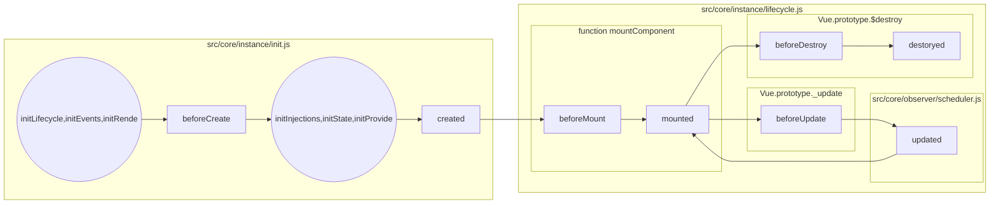
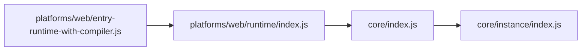

# vue

以 `_` 或 `$` 开头的属性 不会 被 Vue 实例代理(proxy)，因为它们可能和 Vue 内置的属性、 API 方法冲突

## vs React

既然是先接触的 React，那么最开始进行这样的比较也就理所当然了。。以下箭头前面是 vue, 后面是 React

data => state

props => props

`<slot>` => 类似 props.children

mixins => mixins

`functional: true` => 函数式声明组件

父子组件的关系可以总结为 props down, events up


## 指令

* `v-bind`(:)
  * src/compiler/directives/bind.js
* `v-on`(@) 事件
  * src/compiler/directives/on.js
* `v-model`: 在表单中使用, 只是一个语法糖，用于表单双向绑定
  * src/compiler/directives/model.js

```javascript
<input v-model="something">
// 相当于下面的代码
<input v-bind:value="something" v-on:input="something = $event.target.value">
```

### 自定义指令

* [钩子函数](https://cn.vuejs.org/v2/guide/custom-directive.html#钩子函数)
  * `bind`: 只调用一次，指令第一次绑定到元素时调用，用这个钩子函数可以定义一个在绑定时执行一次的初始化动作
  * `inserted`: 被绑定元素插入父节点时调用 (父节点存在即可调用，不必存在于 document 中)
  * `update`: 所在组件的 VNode 更新时调用，但是可能发生在其孩子的 VNode 更新之前。指令的值可能发生了改变也可能没有
  * `componentUpdated`: 所在组件的 VNode 及其孩子的 VNode 全部更新时调用
  * `unbind`: 只调用一次，指令与元素解绑时调用

## 生命周期




## 全局配置

* [ignoredElements](https://cn.vuejs.org/v2/api/#ignoredElements): 定义需要忽略的自定义元素列表

## 全局 API

* `Vue.nextTick(callback)`: 在下次 DOM 更新循环结束之后执行延迟回调(基于 Promise 或 MutationObserver(不支持 Promise 的时候))。在修改数据之后立即使用这个方法，获取更新后的 DOM。

> [Vue nextTick 源码解读 by Lxxyx](https://lxxyx.win/2016/09/25/2016/Vue-nextTick-%E6%BA%90%E7%A0%81%E8%A7%A3%E8%AF%BB/)

* computed(计算属性)(Swift?!!!) <=> watch(观察者)

## Dom 生成

### template

直接使用字符串生成 dom, 如果 Vue 选项中包含 [render](https://cn.vuejs.org/v2/guide/render-function.html) 函数，template 选项将被忽略。

### render(createElement) 函数

可以被理解为主要在没有 complier 的情况下使用(比如一些性能要求比较高的地方)

* [createElement](https://cn.vuejs.org/v2/guide/render-function.html#createElement-参数)
  * 第二个参数支持 class, style, attrs, props, domProps, on, nativeOn, directives, scopedSlots, solt, key, ref
  * `createElement('div', this.$slots.default)` 相当于 `<div><slot></slot></div>`

## Source code(v2.3.3 -> v2.5.0 -> 2.5.3)

[Project Structure](https://github.com/vuejs/vue/blob/dev/.github/CONTRIBUTING.md#project-structure)

* build: 构建相关的文件
  * alias.js: 所有的入口文件的索引
  * config.js: build configurations for all files found in `dist/`
* dist: 构建后文件的输出目录
* src
  * compiler: template string => element AST => render function
    * directives: 指令
    * parser: template string => element AST
    * codegen: element AST => render function
    * optimizer: 分析静态树，优化 vdom 渲染
  * core: 平台无关的核心代码
    * config.js: 定义默认的全局配置
    * observer: reactivity system(数据响应系统，包含数据观测的核心代码)
    * vdom: vdom element creation and patching
    * instance: Vue instance constructor and prototype methods
    * global-api: 给 Vue constructor 挂载的全局方法（静态方法）或属性
    * components: 抽象出来的通用组件，暂时只有 keep-alive
    * util
      * options.js
        * mergeOptions
      * env.js
        * nextTick 一个异步执行队列？！
  * platforms: 平台相关代码
    * web
      * compiler: compiler in platform web
      * runtime: core in platform web
      * entry-runtime-with-compiler.js: vue 入口文件, 包含 compiler(template 到 render 函数)
  * sfc: *.vue files parsing logic
  * shared: common utils and constants

### Vue 构造函数组织起来的基本流程

先从找入口开始吧，从 `package.json` 里可以看到，vue 使用了 rollup 来打包，配置放在 `build/config.js`. 下面主要看两个命令

* dev: 生成 vue.runtime.common.js
* build: 在 dist 目录生成所有文件



可以看到 入口文件为 `platforms/web/entry-runtime-with-compiler.js`

顺着找可以发现 Vue 的构造函数在 `core/instance/index.js`, 以下5个函数里的方法在 Vue 的 prototype 上挂载了一系列方法和属性

其中 init.js 比其他5个更重要, 它的 `Vue.prototype._init` 将在 `new Vue()` 后调用

* `init.js`([Vue.prototype._init](https://github.com/vuejs/vue/blob/v2.5.0/src/core/instance/init.js#L16)):
  * _uid
  * _isVue
  * $options = mergeOptions(Vue.options, 调用Vue构造函数时传入的参数, this)
    * (使用策略对象合并参数选项, strats.* 代表各个对象的策略)
  * _renderProxy = vm(this)
  * _self = vm(this)

  * initLifecycle([lifecycle.js](https://github.com/vuejs/vue/blob/v2.5.0/src/core/instance/lifecycle.js#L23)): $parent, $root, $children, $refs, _watcher, _inactive, _directInactive, _isMouinted, _isDestroyed, _isBeingDestroyed
  * initEvents([event.js](https://github.com/vuejs/vue/blob/v2.5.0/src/core/instance/events.js#L12)): _events, _hasHookEvent
  * initRender([render.js](https://github.com/vuejs/vue/blob/v2.5.0/src/core/instance/render.js#L18)): _vnode, _staticTrees, $solts, $scopedSlots, _c, $createElement

  * initInjections([inject.js](https://github.com/vuejs/vue/blob/v2.5.0/src/core/instance/inject.js#L16))
  * initState([state.js](https://github.com/vuejs/vue/blob/v2.5.0/src/core/instance/state.js#L48)): _watchers, 并添加了一些 observer
    * initProps
    * initMethods
    * initdata
      * 把 vm.data 里的 key 挂到 vm 上: `Object.definePropery(vm, key, { configurable, enumerable, get, set})`, 并通过 _data 劫持
      * observe(data), **详见数据响应系统**
    * initConputed
    * initWatch
  * initProvide([inject.js](https://github.com/vuejs/vue/blob/v2.5.0/src/core/instance/inject.js#L7)): _provided

  * [$mount(vm.$options.el)](https://github.com/vuejs/vue/blob/v2.5.0/src/core/instance/init.js#L69) (如果传递了 el 参数才会走这个，否则要手动挂载) **详见渲染**

* [state.js](https://github.com/vuejs/vue/blob/v2.5.0/src/core/instance/state.js#L308): $data, $props, $set, $delete, $watch
* [events.js](https://github.com/vuejs/vue/blob/v2.5.0/src/core/instance/events.js#L45): $on, $once, $off, $emit
* [lifecycle.js](https://github.com/vuejs/vue/blob/v2.5.0/src/core/instance/lifecycle.js#L49): _update, $forceUpdate, $destroy
* [render.js](https://github.com/vuejs/vue/blob/v2.5.0/src/core/instance/render.js#L52): $nextTick & some render helpers like `_o`, `_n`
  * [_render()](https://github.com/vuejs/vue/blob/v2.5.0/src/core/instance/render.js#L60) return vnode(虚拟DOM对象)

在这之后调用的是 `core/index.js`, 里面的 initGlobalAPI 挂载了静态属性和方法: config, util, set, delete, nextTick, options, _base, version 以及

* `global-api/use.js` use
* `global-api/mixin.js` mixin
* `global-api/extend.js` cid, extend
* `global-api/assets.js` component, directive, filter

在这之后调用的是 `platforms/web/runtime/index.js`

* 覆盖一些在 global-api 里挂载的 config(因为这里已经是web平台特有的地方了)
* 继承一些新的 options.directives(model & show)，options.components(transition and transitionGroup)
* [prototype.__patch__](https://github.com/vuejs/vue/blob/v2.5.0/src/platforms/web/runtime/patch.js#L12) **详见渲染**
* [prototype.$mount](https://github.com/vuejs/vue/blob/v2.5.0/src/platforms/web/runtime/index.js#L37) return [mountComponent()](https://github.com/vuejs/vue/blob/v2.5.0/src/core/instance/lifecycle.js#L143) **详见渲染**

最后回到 `platforms/web/entry-runtime-with-compiler.js`

* [重写](https://github.com/vuejs/vue/blob/v2.5.0/src/platforms/web/entry-runtime-with-compiler.js#L18) prototype.$mount, 并把原来的 $mount 放在最后执行
* [挂载 Vue.compile](https://github.com/vuejs/vue/blob/v2.5.0/src/platforms/web/entry-runtime-with-compiler.js#L97)

### 数据响应系统

* src/core/observer/index.js
  * observe(value)
    * new Observer(value)
      * defineReactive()
        * get: 先调用了 Watcher(key, callback) => pushTarget(Watcher) => dep.depend()
        * set: dep.notify()
* src/core/observer/dep.js
* src/core/observer/watcher.js

总而言之，就是 data 下的每个属性都有一个唯一的 dep 实例，在该属性的 get() 中收集依赖(push进一个数组)， 并在 set() 中触发所有收集的依赖(`dep.notify()`)

### 渲染

* [function mountComponent](https://github.com/vuejs/vue/blob/v2.5.0/src/core/instance/lifecycle.js#L143)
  * [vm._watcher = new Watcher(vm, updateComponent, noop)](https://github.com/vuejs/vue/blob/v2.5.0/src/core/instance/lifecycle.js#L196)
    * [vm._update(vm._render(), hydrating)](https://github.com/vuejs/vue/blob/v2.5.0/src/core/instance/lifecycle.js#L192): 此处做 patch 或者 直接创建新的 vnode
      * `vm.render()` in `render.js`: 此处对 data 里的变量求值，也就触发了响应系统里的 `get()`
      * `vm.__patch__`(virtral-dom) in [createPatchFunction](https://github.com/vuejs/vue/blob/v2.5.0/src/core/vdom/patch.js#L69)
        * [patch](https://github.com/vuejs/vue/blob/v2.5.0/src/core/vdom/patch.js#L631) 返回新的vdom(期间进行真实的 dom 更新操作)
        此处用的应该是 [snabbdom](https://github.com/snabbdom/snabbdom/blob/master/src/snabbdom.ts#L284)
          * 如果 oldVnode 不存在，则直接[createElm](https://github.com/vuejs/vue/blob/v2.5.0/src/core/vdom/patch.js#L643)
          * 如果新旧节点的属性基本相同 (sameVnode(oldVnode, vnode)), (也就是说只可能是 text 或者 childrenNode 不相同)则调用 [patchVnode](https://github.com/vuejs/vue/blob/v2.5.0/src/core/vdom/patch.js#L648)
            * [updateChildren](https://github.com/vuejs/vue/blob/v2.5.0/src/core/vdom/patch.js#L501), 这里面就复杂了...递归的 patch..
          * 如果新旧节点的属性大不相同, 则没有 diff 的必要了，直接 [createElm](https://github.com/vuejs/vue/blob/v2.5.0/src/core/vdom/patch.js#L679) createElm 里会做具体的 dom 操作

> [Vue 2.0 的 virtual-dom 实现简析 by DDFE](https://github.com/DDFE/DDFE-blog/issues/18)
>
> [解析vue2.0的diff算法 by aooy](https://github.com/aooy/blog/issues/2)

### 事件

和 React 不一样, vue 貌似没有使用事件代理, 而是把事件直接绑定到每个 DOM 上了

### 主要 Class

* [VNode(tag, data, children, text, elm, context, componentOptions)](https://github.com/vuejs/vue/blob/v2.5.0/src/core/vdom/vnode.js)
  * elm: 真实对应的 node
* Watcher(vm, expOrFn, cb, options) `src/core/observer/watcher.js`
* Observer(value) `src/core/observer/index.js`

> [Vue源码学习 by HcySunYang](http://hcysun.me/2017/03/03/Vue%E6%BA%90%E7%A0%81%E5%AD%A6%E4%B9%A0/)

