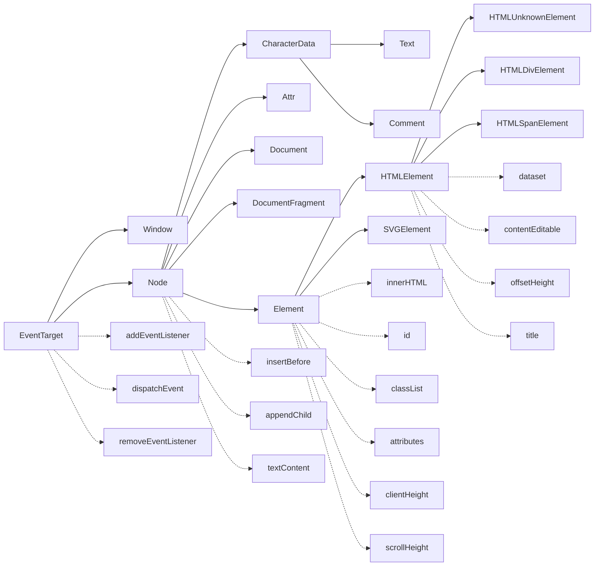

# Web Components

## Custom Elements

* Custom Elements vs HTMLUnknownElement

```javascript
document.createElement('username') instanceof HTMLUnknownElement;    // 返回值是true
document.createElement('user-name') instanceof HTMLUnknownElement;    // 返回值是false
// 更多的:
document.createElement('div') instanceof HTMLDivElement; // true
document.createElement('span') instanceof HTMLSpanElement; // true
```

## 相关 DOM 对象的继承关系:

> [DOM in MDN](https://developer.mozilla.org/en-US/docs/Web/API/Document_Object_Model)
>
> [webidlpedia](https://github.com/dontcallmedom/webidlpedia)




* `DocumentFragment` (文档碎片)可以临时在内存里生成 dom tree, 用来插入大量子节点会提高效率

> [HTMLUnknownElement与HTML5自定义元素的故事 by 张鑫旭](http://www.zhangxinxu.com/wordpress/2018/03/htmlunknownelement-html5-custom-elements/)