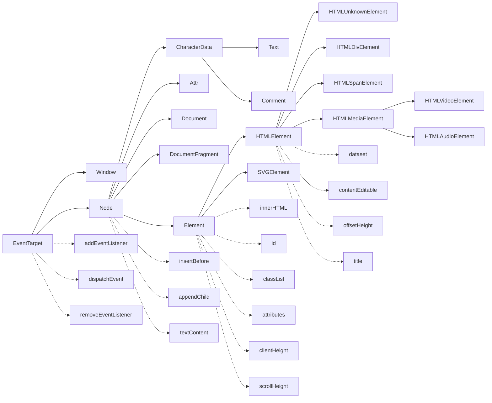

# DOM

## 相关 DOM 对象的继承关系

* `DocumentFragment` (文档碎片)可以临时在内存里生成 dom tree, 用来插入大量子节点会提高效率

## MutationObserver

监视 DOM 树的变化

## WEB 编辑器相关 API

* [scrollIntoView 与 scrollIntoViewIfNeeded API 介绍(当前的元素滚动到浏览器窗口的可视区域内(可用于键盘抬起时))](https://juejin.im/post/59d74afe5188257e8267b03f)
* Selection 和 Range
  * 做文本编辑器, 划词输入的时候要用到
  * Selection 对象代表页面中的文本选区。一般是由用户拖拽鼠标选中文字或图片等其他元素而产生
  * Range 表示包含节点和部分文本节点的文档片段
  * Chrome 里暂时不支持选中多个 range
  * [Programmatically select text in a contenteditable HTML element](https://stackoverflow.com/questions/6139107/programmatically-select-text-in-a-contenteditable-html-element)
  * document.execCommand
    * 主要影响当前的 Selection 内容
    * formatBlock: 添加一个HTML块式标签在包含当前选择的行, 如果已经存在了，更换包含该行的块元素

> [selection 和 range 介绍  by rguanghui](https://github.com/rguanghui/Whole/issues/2)
>
> [基于 document.execCommand 实现富文本编辑器](https://imys.net/demo/cmdEditor.html)
>
> [DOM in MDN](https://developer.mozilla.org/en-US/docs/Web/API/Document_Object_Model)
