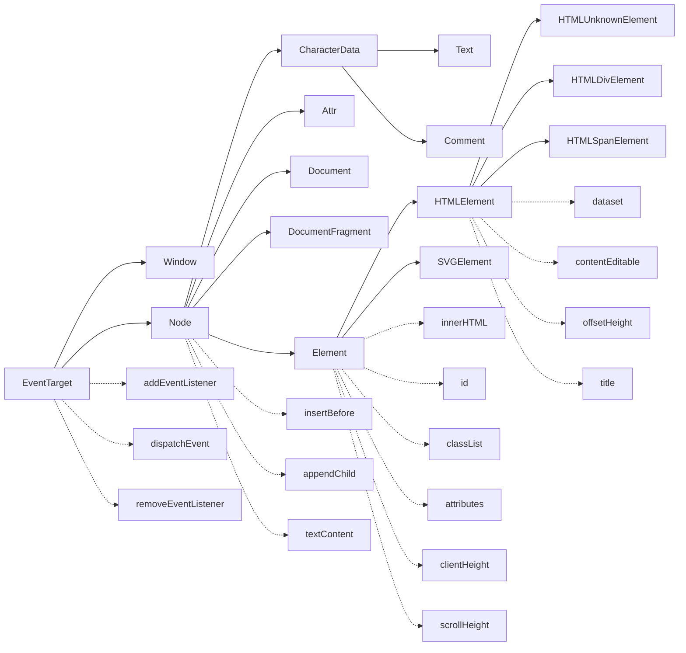

# DOM

## 相关 DOM 对象的继承关系

> [DOM in MDN](https://developer.mozilla.org/en-US/docs/Web/API/Document_Object_Model)
>
> [webidlpedia](https://github.com/dontcallmedom/webidlpedia)

* `DocumentFragment` (文档碎片)可以临时在内存里生成 dom tree, 用来插入大量子节点会提高效率
