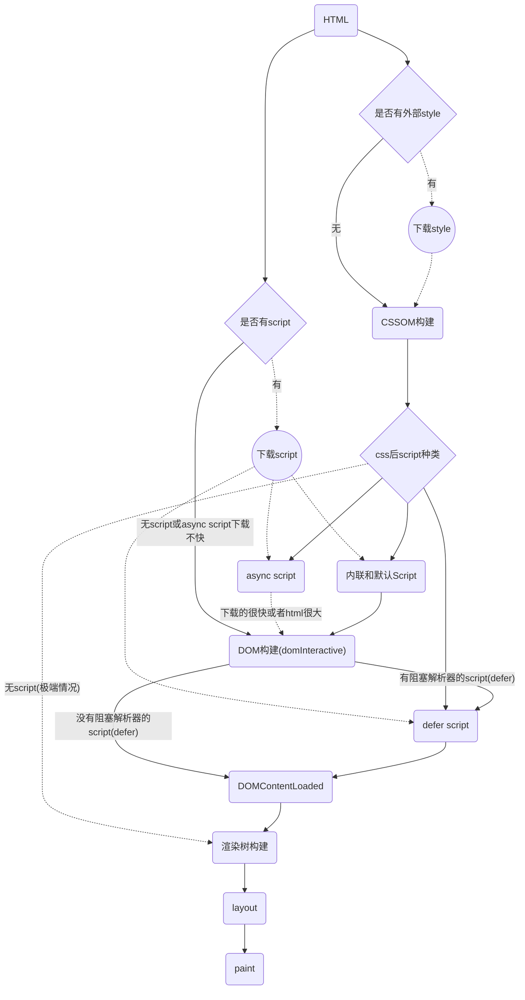

# Web 加载

## 优化内容效率

* 懒加载
* 压缩
* 图像优化
* 网页字体优化
* TCP 的 first roundtrip 只能发 14KB, 所以尽量将文件限制在这个大小

## [HTTP 缓存](2016-02-24-http-cache.md)

## 离线化

* ServiceWorker
* Local Storage
* HTML5 的manifest离线机制

## 加载顺序优化

* 当 HTML 解析器遇到一个 script 标记时，它会暂停构建 DOM，将控制权移交给 JavaScript 引擎；等 JavaScript 引擎运行完毕，浏览器会从中断的地方恢复 DOM 构建(js在何处插入，就在何处执行)
* 同样 js 也会阻塞 CSSOM 的构建, 因为他会查询或者计算任何对象的 style
* CSS 会阻塞 CSSOM 从而阻塞渲染树构建(非 dom 树, 所以外联 CSS 不会阻塞 domContentLoaded)

* [避免使用 @import css](https://www.qianduan.net/high-performance-web-site-do-not-use-import/)

> [Deciphering the Critical Rendering Path by Ilya Grigorik](https://calendar.perfplanet.com/2012/deciphering-the-critical-rendering-path/)

### Navigation Timing API

* `performance.timing`
  * domInteractive 表示 DOM 准备就绪的时间点。(DOM tree ready)
  * domContentLoaded 一般表示 DOM 和 CSSOM 均准备就绪的时间点。
    * 如果没有阻塞解析器的 JavaScript，则 DOMContentLoaded 将在 domInteractive 后立即触发。
  * domComplete 表示网页及其所有子资源都准备就绪(包括图片资源)的时间点。从这里开始浏览器右上角的菊花将会停止
  * loadEvent：domComplete 后会立即触发, 作为每个网页加载的最后一步，浏览器会触发 onload 事件，以便触发额外的应用逻辑。
* `performance.getEntriesByType("resource")`: 获取所有加载资源的 performance

### async && defer

* 使用 async 标签可以使 js 在下载过程中不阻塞 DOM构建
* 使用 defer 可以在 async 的基础上即使 js 下载完成了也不阻塞 DOM 构建
* 使用 defer 标签不会阻塞 domInteractive, *但会阻塞 domContentLoaded*
* 使用 async 标签在*通常的下载的速度下*不会阻塞 domInteractive 与 domContentLoaded
* script created by `document.createElement` is async script
* DOMContentLoaded 和阻止渲染是两个概念, 不要混淆了

> [Page lifecycle: DOMContentLoaded, load, beforeunload, unload](http://javascript.info/tutorial/onload-ondomcontentloaded)
>
> [whatwg's HTML Living Standard for defer script](https://html.spec.whatwg.org/multipage/scripting.html#attr-script-defer)

### Page lifecycle API

* DOMContentLoaded, load 和 Page Lifecycle API 没有必然联系
* beforeunload 只应被用来提示用户有为存储信息
  * [`beforeunload`在iOS里不支持](https://stackoverflow.com/questions/3239834/window-onbeforeunload-not-working-on-the-ipad)
* `chrome://discards/`: 当前页面状态

> [Page Lifecycle API by Philip Walton](https://developers.google.com/web/updates/2018/07/page-lifecycle-api#developer-recommendations-for-each-state)

首屏关键路径(个人总结)(TODO: 总结一个不一定最全面, 但是要更通俗易懂的版本...)

* 不是每次dom 构建后都需要 paint (如果啥都没变为啥要呢..), 有可能在 dom 构建完成(DOMContentLoaded)前先 paint 过部分 dom 了
* 当渲染时间远小于 script 下载时间, 浏览器会选择先 paint 出已经 parse 的 html 部分(貌似也需要script标签在文档尾部?!)
  * 机器性能好的时候(pc)
  * script下载很慢的时候(不在本地)
* parse html 的时候即使没有 parse 到外部 js 的部分也会开始下载?!

## 其他

* `navigator.connection.effectiveType` 可以更准确的检测当前网络环境, chrome 62 开始支持
