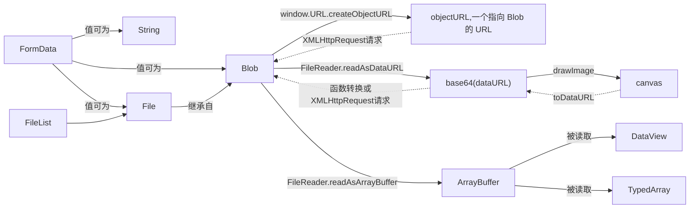

# 文件和二进制的操作



* [Blob](https://developer.mozilla.org/zh-CN/docs/Web/API/Blob): (Binary Large Object): 对象表示一个不可变, 原始数据的类文件对象
  * `new Blob(实际数据的数组, 数据类型)`
  * [File](https://developer.mozilla.org/zh-CN/docs/Web/API/File) 继承自 Blob, 扩展了更多的对象的属性
  * 基于 Base64 编码的 data-uri 对象转换为 Blob
    * [NPM 包](https://www.npmjs.com/package/b64-to-blob)
    * [Stack overflow 上提供的方法](ttps://stackoverflow.com/questions/16245767/creating-a-blob-from-a-base64-string-in-javascript), 主要包括函数和发送请求两种
    * [这里](https://chiayilai.com/image-%E5%90%84%E7%A8%AE%E5%9E%8B%E6%85%8B%E8%BD%89%E6%8F%9Bblob-dataurl-canvas-in-javascript/)介绍了 blob, base64, canvas 之间的转换方法
* `URL.createObjectURL` 用于生成指向 Blob 对象的 URL
  * 利用URL对象，在网页插入图片: `img.src = window.URL.createObjectURL(files[i])`
* FileReader 用来读取 Blob 和 File 内的内容, 是异步操作
  * `readAsDataURL` 返回一个基于 Base64 编码的 data-uri 对象
  * `readAsText` 返回文本字符串
  * `readAsArrayBuffer` 返回 ArrayBuffer
* FileList: File 的数组
  * 因为安全原因, input 框里的 FileList 不能用 js 改变
* [FormData](https://developer.mozilla.org/zh-CN/docs/Web/API/FormData/Using_FormData_Objects): 组装发送`XMLHttpRequest`请求的键值对, 值可以是 String, Blob, File

## 文件上传

```javascript
const formData = new FormData();
// 直接获取 fileDom 里的信息
const file = document.getElementById('file').files[0];
formData.append("data", file);
// 人工生成 File
// https://stackoverflow.com/questions/2198470/javascript-uploading-a-file-without-a-file/22858914#22858914
const blob = new Blob(['Lorem ipsum'], { type: 'plain/text' });
formData.append('file', blob, 'readme.txt');
// 上传
const request = new XMLHttpRequest();
request.open('POST', 'http://example.org/upload');
request.send(formData);
```

* [FormData 的数据集已经是经过 `multipart/form-data` 算法编码过的，因此上传时不需要再设置相应的 header(额外设置会把已有的 Boundary 覆盖掉)](https://zhuanlan.zhihu.com/p/34291688)
* multipart/form-data 的格式为:

```shell
Content-Type:multipart/form-data; boundary=----WebKitFormBoundaryrGKCBY7qhFd3TrwA

------WebKitFormBoundaryrGKCBY7qhFd3TrwA
Content-Disposition: form-data; name="text"

title
------WebKitFormBoundaryrGKCBY7qhFd3TrwA
Content-Disposition: form-data; name="file"; filename="chrome.png"
Content-Type: image/png

PNG ... content of chrome.png ...
------WebKitFormBoundaryrGKCBY7qhFd3TrwA--
```

axios 在 NodeJS 环境[不支持](https://github.com/axios/axios/issues/789) 发送 multipart/form-data

## 文件接收

服务端可以通过 `formidable` 接收或者直接拼接 body 接收

> [文件和二进制的操作 by ruanyifeng](http://javascript.ruanyifeng.com/htmlapi/file.html)
>
> [Using files from web applications in MDN](https://developer.mozilla.org/en-US/docs/Using_files_from_web_applications)
>
> [nodejs学习之文件上传 by W·Axes](https://www.cnblogs.com/axes/p/4308430.html)
