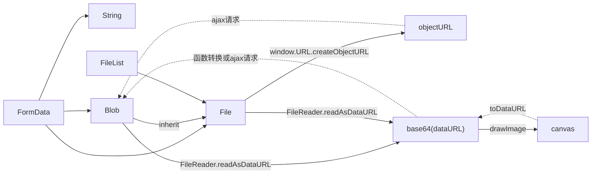

# 文件和二进制的操作

BLOB: Binary Large Object，二进制大对象



> [image (blob, dataURL, canvas)转换](https://chiayilai.com/image-%E5%90%84%E7%A8%AE%E5%9E%8B%E6%85%8B%E8%BD%89%E6%8F%9Bblob-dataurl-canvas-in-javascript/)

* [Blob](https://developer.mozilla.org/zh-CN/docs/Web/API/Blob): (Binary Large Object): `new Blob(实际数据的数组, 数据类型)`
* [File](https://developer.mozilla.org/zh-CN/docs/Web/API/File) 继承自 Blob, 扩展了更多的对象的属性
  * [Creating a Blob from a base64 string in JavaScript](https://www.npmjs.com/package/b64-to-blob)
    > [so](https://stackoverflow.com/questions/16245767/creating-a-blob-from-a-base64-string-in-javascript)
* URL 用于生成指向File对象或Blob对象的URL
  * 利用URL对象，在网页插入图片: `img.src = window.URL.createObjectURL(files[i])`
* FileReader 用来读取 Blob 和 File 内的内容, 为异步操作
  * `readAsDataURL` 返回一个基于Base64编码的data-uri对象
  * `readAsText` 返回文本字符串
* FileList
  * 因为安全原因, input 框里的 FileList 不能用 js 改变
* [FormData](https://developer.mozilla.org/zh-CN/docs/Web/API/FormData/Using_FormData_Objects): 组装发送`XMLHttpRequest`请求的键值对
  * 增加一个字段： `formData.append('file', blob, 'text.txt')`

> [文件和二进制的操作 by ruanyifeng](http://javascript.ruanyifeng.com/htmlapi/file.html)
>
> [Using files from web applications](https://developer.mozilla.org/en-US/docs/Using_files_from_web_applications)

## 文件上传

* [Javascript: Uploading a file… without a file](https://stackoverflow.com/a/22858914/2307918)
* FormData 的数据集已经是经过 `multipart/form-data` 算法编码过的，因此上传时不需要再设置相应的 header(额外设置会把已有的 Boundary 覆盖掉)
  >[踩坑篇--使用 fetch 上传文件](https://zhuanlan.zhihu.com/p/34291688)
  * multipart/form-data 的格式为:

  ```shell
  Content-Type:multipart/form-data; boundary=----WebKitFormBoundaryrGKCBY7qhFd3TrwA

  ------WebKitFormBoundaryrGKCBY7qhFd3TrwA
  Content-Disposition: form-data; name="text"

  title
  ------WebKitFormBoundaryrGKCBY7qhFd3TrwA
  Content-Disposition: form-data; name="file"; filename="chrome.png"
  Content-Type: image/png

  PNG ... content of chrome.png ...
  ------WebKitFormBoundaryrGKCBY7qhFd3TrwA--
  ```

前端示例上传代码

<<< @/playground/web/form-file/upload-file.html

服务端示例上传代码

<<< @/playground/web/form-file/upload-file.js

服务端示例接收代码

<<< @/playground/web/form-file/receive-file.js
  
> [axios Send multipart/form-data with axios in nodejs discuss](https://github.com/axios/axios/issues/789)
>
> [nodejs学习之文件上传 by W·Axes](https://www.cnblogs.com/axes/p/4308430.html)
