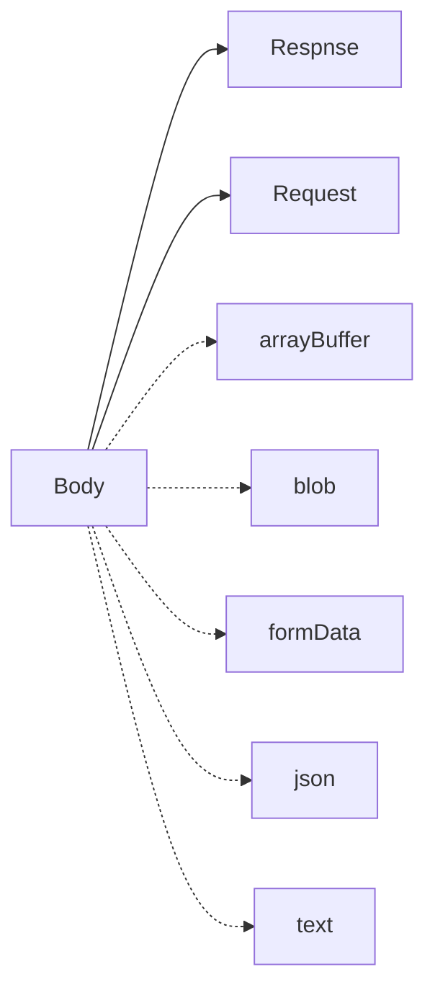

# Fetch



* [Body](https://developer.mozilla.org/zh-CN/docs/Web/API/Body)
  * [Request](https://developer.mozilla.org/zh-CN/docs/Web/API/Request)
  * [Response](https://developer.mozilla.org/zh-CN/docs/Web/API/Response)
* [Abortable fetch](https://developers.google.com/web/updates/2017/09/abortable-fetch?utm_source=feed&utm_medium=feed&utm_campaign=updates_feed)

## Fetch timeout

```javascript
export default function MyFetch(url, timeout) {
  if (!timeout) {
    return fetch(url);
  }
  let abort_fn = null;

  const abort_promise = new Promise(function(resolve, reject) {
    abort_fn = function() {
      reject('fetch timeout');
    };
  });

  const abortable_promise = Promise.race([fetch(url), abort_promise]);

  setTimeout(function() {
    abort_fn();
  }, timeout);

  return abortable_promise;
}
```

## 与 axios 区别

* 可以与 Service Worker 配合 `self.addEventListener('fetch', function(event) {}`
* 404，500 时不进入 catch
* POST 请求需要额外设置 headers, body
* 默认行为不同
* 没有timeout

> [【译】为什么我不再使用Fetch API开发应用](https://zhuanlan.zhihu.com/p/28206325)
>
> [[Question] what advantage does axios give us over fetch? EOM](https://github.com/axios/axios/issues/314)