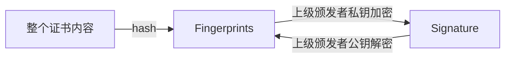
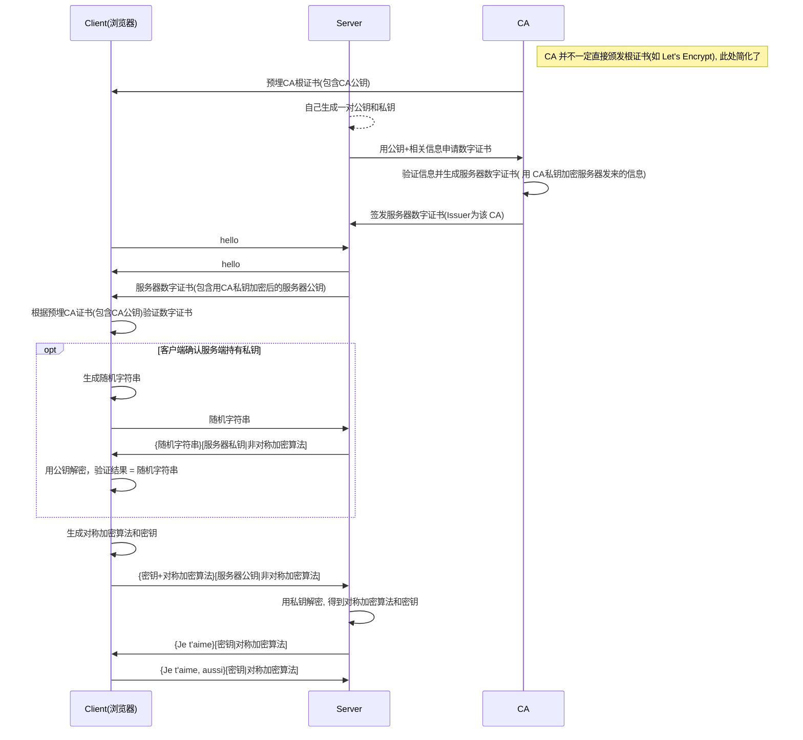

# HTTP

## Headers

### General

* Request Method
  * POST, GET, etc...
    * 浏览器对 POST 的限制一般在 2 - 4Gb(好吧, 再大的话浏览器也要爆掉了), 对 GET 的限制取决于不同浏览器的实现, 一般为 2 - 8 kb
    * 服务端对 POST 的限制一般默认为 2mb
    > [stackoverflow](http://stackoverflow.com/questions/2659952/maximum-length-of-http-get-request)
    >
    > [motobit](http://www.motobit.com/help/scptutl/pa98.htm)
* Status Code
  * 1xx(请求处理中)
  * 2xx(成功)
    * 201 created
  * 3xx(重定向)
  * 4xx(客户端问题)
  * 5xx(服务端问题)

### Response Headers

* Content-Type
  * 响应头中，告诉客户端返回的内容的类型实际上是什么
  * 请求头中，表示客户端告诉服务端实际发送的数据类型
  * [从Gecko 2.0开始，text/plain, application/x-www-form-urlencoded 和 multipart/form-data 类型的数据都可以直接用于跨站请求，而不需要先发起“预请求”了。之前，只有 text/plain 可以不用先发起“预请求”，进行跨站请求。](https://developer.mozilla.org/zh-CN/docs/Web/HTTP/Access_control_CORS)
    * 从这里可以看出, `application/json` 是会发起预请求的...
    * 如果人为设置了对 CORS 安全的首部字段集合之外的其他首部字段，也还是要发预请求(preflight)的
      > [CORS error :Request header field Authorization is not allowed by Access-Control-Allow-Headers in preflight response](https://stackoverflow.com/questions/42061727/cors-error-request-header-field-authorization-is-not-allowed-by-access-control)
      >
      > [CORS protocol and credentials for fetch](https://fetch.spec.whatwg.org/#cors-protocol-and-credentials)
      >
      > [fetch 跨域该怎么写？ - Seven的回答](https://www.zhihu.com/question/47029864/answer/150069385)

> [四种常见的 POST 提交数据方式 by Jerry Qu](https://imququ.com/post/four-ways-to-post-data-in-http.html)
>
> [HTTP Content-type 对照表](http://tool.oschina.net/commons)
* Content-Length: 用来告知客户端应该怎样解码才能获取在 Content-Type 中标示的媒体类型内容
  * 除非使用了分块编码[Transfer-Encoding: chunked](https://imququ.com/post/transfer-encoding-header-in-http.html)，否则使用了*持久化连接(keep-alive)*响应头首部必须存在 Content-Length 首部
* Content-Encoding: 采用何种编码格式传输正文
  * gzip
  * compress
  * deflate
  * identity
  * br [Brotli](https://zh.wikipedia.org/wiki/Brotli)算法, 貌似 google 首页现在用的就是这个.
  > [HTTP 协议中的 Content-Encoding by ququ](https://imququ.com/post/content-encoding-header-in-http.html)
* Transfer-Encoding: 传输编码, 用来改变报文格式
  * chunked: 数据以一系列分块的形式进行发送。(浏览器可以在文件完全下载前就开始解析文件(需要在服务端 TCP 层去做优化))
  * compress
  * deflate
  * gzip
  * identity
  > [HTTP 协议中的 Transfer-Encoding by ququ](https://imququ.com/post/transfer-encoding-header-in-http.html)

以上两个的顺序是 先 Content-Encoding 再 Transfer-Encoding
> [how much data must be sent before browsers start rendering it?](https://stackoverflow.com/questions/16909227/using-transfer-encoding-chunked-how-much-data-must-be-sent-before-browsers-s)

* Referrer 是错别字....但是将错就错了

### Request Headers

* Connection

`Connection: keep-alive`: 服务端和客户端都可以使用它告诉对方在发送完数据之后不需要断开 TCP 连接，以备后用, HTTP/1.1 则规定所有连接都必须是持久的，除非显式地在头部加上 Connection: close.

实际上，HTTP/1.1 中 Connection 这个头部字段已经没有 keep-alive 这个取值了，但由于历史原因，很多 Web Server 和浏览器，还是保留着给 HTTP/1.1 长连接发送 Connection: keep-alive 的习惯

## API

### XMLHttpRequest(XHR)

* level1
  * onreadystatechange
* level2
  * onload
  * onerror
  * onprogress

### [Fetch](2018-05-18-fetch.md)

### Server-Sent Events

* [Server-Sent Events in whatwg](https://html.spec.whatwg.org/multipage/server-sent-events.html#server-sent-events) (EventSources)(单向通道，只能服务器向浏览器发送, 适合用于推送)

> [使用服务器发送事件](https://developer.mozilla.org/zh-CN/docs/Server-sent_events/Using_server-sent_events)

---

## HTTP/1.1

* HTTP/1.1 的最大问题：一个 TCP 链接同时只能传输一个 HTTP 请求/响应, HTTP/2 就有多路复用了

## HTTP/2

* [HTTP/2 officel site](https://http2.github.io/)
* [Chrome 自带的 HTTP/2 查看工具](chrome://net-internals/#http2)

* 多路复用(将多个请求在一个连接(TCP)上同时发送)
  * 因此不需要再尽力减少请求数量了
  * no need Domain Sharding anymore
* Server Push(未发先至)
  * 根据客户端需求，服务端主动推送资源，减少请求耗时
* 首部压缩
  * 使用 [HPACK](http://http2.github.io/http2-spec/compression.html) 算法
* 优先级和依赖性（Priority）
  * 可以请求的时候告知服务器端，资源分配权重，优先加载重要资源

> [http2讲解 by Daniel Stenberg](https://ye11ow.gitbooks.io/http2-explained/content/)
>
> [HTTP/2 简介 by google](https://developers.google.com/web/fundamentals/performance/http2/?hl=zh-cn)

## HTTPS

* 在 TCP 和 HTTP 之间增加了加密(TLS/SSL)层
  * TLS: Transport Layer Security(传输层安全协议)
  * SSL: TLS 的前身
* Chrome 只在 TLS 上实现了 http2, 因此大部分时间 HTTP2 和 HTTPS 是同时存在的

### 加密算法

* 非对称加密算法: 通过一把密钥加密的内容可以并且只能由与之配对的另一把密钥能够解密, 比如 RSA, ECDSA
  * 非对称加密性能很低, 所以一般只在第一次握手时使用，通过握手交换对称加密密钥，在之后的通信走对称加密。
* 对称加密算法: AES，RC4，3DES
* HASH算法(不可逆): MD5，SHA1，SHA256

### 流程

* CA(Certificate Authority, 数字证书认证机构) 是负责发放和管理数字证书的权威机构

* 数字证书基本构成
  * Subject (所有人) 如 pbdm.cc
  * Issuer (上级证书的发布机构), 如 Let's Encrypt(根证书的 Subject 和 Issuer 是一样的, 所以 Let's Encrypt 颁发的并不是根证书)
  * Valid from , Valid to (证书的有效期)
  * Public key (**所有人**公钥) 非对称加密算法的公钥
  * Signature (数字签名), 指纹的加密(使用**上级颁发者**的私钥)结果就是数字签名
  * Signature algorithm (数字签名算法) 一种对称加密算法, 如 RSA
  * Fingerprints (指纹), 用来保证证书的完整性
  * Fingerprints algorithm(指纹算法), 一种 不可逆的 hash 算法, 如 SHA-256
* 证书的签名是由上级颁发者的私钥加密的
* 如果用上级颁发者的公钥解密成功，说明该证书的确是用 CA 的私钥加密的，可以认为被验证方是可信的

注意: **证书里的公钥私钥和服务器里的公钥和私钥不是一个东西**

数字证书链示意

非完整简单流程图:

> [HTTPS 那些协议：TLS, SSL, SNI, ALPN, NPN by Harttle](http://harttle.land/2018/03/25/https-protocols.html)
>
> [数字证书原理](http://www.cnblogs.com/JeffreySun/archive/2010/06/24/1627247.html)
>
> [数字签名是什么 by ruanyifeng](http://www.ruanyifeng.com/blog/2011/08/what_is_a_digital_signature.html)

### 证书生成

> [HTTPS证书生成原理和部署细节](https://www.barretlee.com/blog/2015/10/05/how-to-build-a-https-server/)

### HSTS

[HSTS:HTTP严格传输安全(用户不能忽略浏览器警告继续访问网站)](https://zh.wikipedia.org/wiki/HTTP%E4%B8%A5%E6%A0%BC%E4%BC%A0%E8%BE%93%E5%AE%89%E5%85%A8)

* [sslstrip](https://weils.net/blog/2016/08/05/http-https-hsts-vs-mitm-sslstrip/)

> [聊聊 HSTS 下的 HTTPS 降级问题 - 小胡子哥](http://www.barretlee.com/blog/2017/04/01/hsts-downgrade/)
>
> [查看 chrome HSTS Preload 域名](chrome://net-internals/#hsts)
