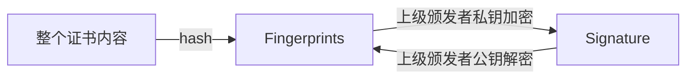
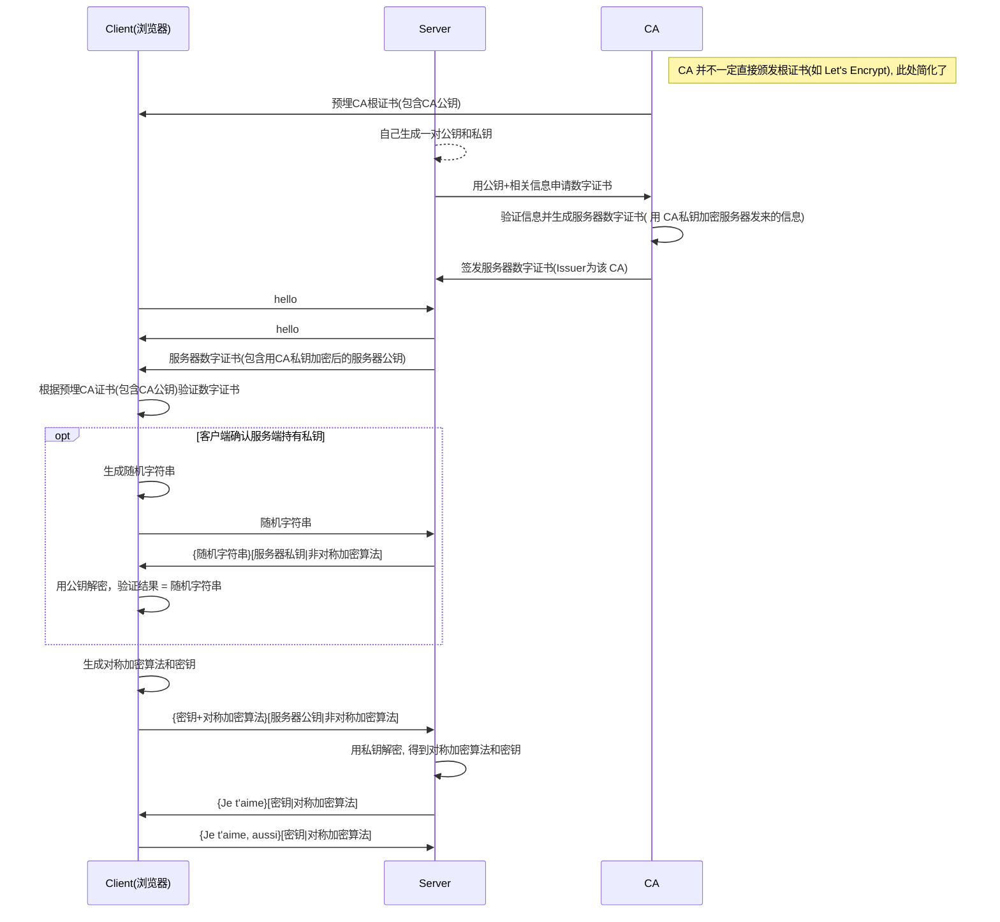

# HTTP

* [http in MDN](https://developer.mozilla.org/en-US/docs/Web/HTTP)
* [for-GET/know-your-http-well in github](https://github.com/for-GET/know-your-http-well)

## Request Method

* restful 四大方法
  * GET: 查询
  * POST: 新增(url 不能在客户端确定), 修改(非幂等)
    * 浏览器对 POST 的限制一般在 2 - 4Gb(好吧, 再大的话浏览器也要爆掉了), 对 GET 的限制取决于不同浏览器的实现, 一般为 2 - 8 kb
    * 服务端对 POST 的限制一般默认为 2mb
    > [stackoverflow](http://stackoverflow.com/questions/2659952/maximum-length-of-http-get-request)
    >
    > [motobit](http://www.motobit.com/help/scptutl/pa98.htm)

  * PUT: 修改, 新增(url 可在客户端确定情况)(幂等, idempotence, 如果一个方法重复执行多次，产生的效果是一样的)

  > [HTTP中post和put的根本区别和优势 by zhihu](https://www.zhihu.com/question/48482736)

  * DELETE: 删除
* HEAD: 同 GET, 但只返回头部和状态码
* CONNECT
* OPTIONS
* TRACE
* PATCH: 部分修改

> [rfc7231](https://tools.ietf.org/html/rfc7231#section-4)

## Response Status Code

* 1xx(请求处理中)
* 2xx(成功)
  * 201 created
* 3xx(重定向)
* 4xx(客户端问题)
* 5xx(服务端问题)

## [Headers](https://developer.mozilla.org/en-US/docs/Web/HTTP/Headers)

* [The headers we don't want by Andrew Betts](https://www.fastly.com/blog/headers-we-dont-want)

### 分类

* General header: Headers applying to both requests and responses but with no relation to the data eventually transmitted in the body.
* Request header: Headers containing more information about the resource to be fetched or about the client itself.
* Response header: Headers with additional information about the response, like its location or about the server itself (name and version etc.).
* Entity header: Headers containing more information about the body of the entity, like its content length or its MIME-type.

### Content-Type

* **Entity header**
* 又被称作[媒体类型(IANA Media Types)](https://www.iana.org/assignments/media-types/media-types.xhtml), MDN 上称作[MIME(Multipurpose Internet Mail Extensions) type](https://developer.mozilla.org/zh-CN/docs/Web/HTTP/Basics_of_HTTP/MIME_Types)
  * [Chromium 如何通过 MIME Type 确定文档类型](https://cs.chromium.org/chromium/src/net/base/mime_sniffer.cc?sq=package:chromium&dr=CS&l=5)
  * 有些 IANA 列表里没有的(标准外的)可以在 [MIME type database](http://mimeapplication.net/) 找到, 比如 `application/x-zip-compressed`
  * [MIME type list](https://github.com/samuelneff/MimeTypeMap/blob/master/src/MimeTypes/MimeTypeMap.cs) (貌似这个比较全...)
* 响应头中，告诉客户端返回的内容的类型实际上是什么
* 请求头中，表示客户端告诉服务端实际发送的数据类型
* 如果请求含有 body, 则必须有 `Content-type`, 如果不发送, 默认为 `application/octet-stream`
* `text/javascript` 已经[废弃](https://stackoverflow.com/questions/876561/when-serving-javascript-files-is-it-better-to-use-the-application-javascript-or), 用 `application/javascript` 替代
* 如果是 GET 方法, 虽然可以发送 `Content-type`, 但是貌似[并没有太大意义](https://stackoverflow.com/questions/5661596/do-i-need-a-content-type-for-http-get-requests)
* `application/x-www-form-urlencoded` 格式类似于 url querystring

> [四种常见的 POST 提交数据方式 by Jerry Qu](https://imququ.com/post/four-ways-to-post-data-in-http.html)

### Content-Length

* **Entity header**
* 用来告知客户端应该怎样解码才能获取在 Content-Type 中标示的媒体类型内容
* 除非使用了分块编码[Transfer-Encoding: chunked](https://imququ.com/post/transfer-encoding-header-in-http.html)，否则使用了*持久化连接(keep-alive)*响应头首部必须存在 Content-Length 首部

### Content-Encoding

* **Entity header**
* 采用何种编码格式传输正文
* gzip
* compress
* deflate
* identity
* br [Brotli](https://zh.wikipedia.org/wiki/Brotli)算法, 貌似 google 首页现在用的就是这个.

> [HTTP 协议中的 Content-Encoding by ququ](https://imququ.com/post/content-encoding-header-in-http.html)

### Transfer-Encoding

* **Response header**
* 传输编码, 用来改变报文格式
* chunked: 数据以一系列分块的形式进行发送。(浏览器可以在文件完全下载前就开始解析文件(需要在服务端 TCP 层去做优化))
* compress
* deflate
* gzip
* identity

> [HTTP 协议中的 Transfer-Encoding by ququ](https://imququ.com/post/transfer-encoding-header-in-http.html)

我们总是先 Content-Encoding 再 Transfer-Encoding
> [how much data must be sent before browsers start rendering it?](https://stackoverflow.com/questions/16909227/using-transfer-encoding-chunked-how-much-data-must-be-sent-before-browsers-s)

### Connection

* **General header**
* 同时可存在于 Request 和 Response
* 只是对上个节点和当前节点之间的连接进行说明, 不会逐层传递(有 Proxy 时)
* `Connection: keep-alive`: 服务端和客户端都可以使用它告诉对方在发送完数据之后不需要断开 TCP 连接，以备后用, HTTP/1.1 则规定所有连接都必须是持久的，除非显式地在头部加上 Connection: close.
* 实际上，HTTP/1.1 中 Connection 这个头部字段已经没有 keep-alive 这个取值了，但由于历史原因，很多 Web Server 和浏览器，还是保留着给 HTTP/1.1 长连接发送 Connection: keep-alive 的习惯

#### Proxy-Connection

* [rfc7230(HTTP/1.1 Message Syntax and Routing, keep-alive)](https://tools.ietf.org/html/rfc7230#appendix-A.1.2)
* HTTP2 是没有这个 header 的定义的

> [Http 请求头中的 Proxy-Connection by ququ](https://imququ.com/post/the-proxy-connection-header-in-http-request.html)

### [Host](https://developer.mozilla.org/en-US/docs/Web/HTTP/Headers/Host)

* **Request header**
* **目标服务器**的域名 + 端口号

### [Origin](https://developer.mozilla.org/en-US/docs/Web/HTTP/Headers/Origin)

* Request header
* **发送方**的域名 + 端口号

### Referer

* **Request header**
* Referrer 的错别字....但是将错就错了

> [Referrer 还是 Referer？ by ququ](https://imququ.com/post/referrer-or-referer.html)

### [缓存相关 Headers](2016-02-24-http-cache.md)

## CORS(Cross-Origin Resource Sharing)

* [CORS in MDN](https://developer.mozilla.org/zh-CN/docs/Web/HTTP/Access_control_CORS)
* 从Gecko 2.0开始，`text/plain`, `application/x-www-form-urlencoded` 和 `multipart/form-data` 类型的数据都可以直接用于跨站请求，而不需要先发起“预请求”了。之前，只有 `text/plain` 可以不用先发起“预请求”，进行跨站请求。
  * 从这里可以看出, `application/json` 是会发起预请求的...
  * 如果人为设置了对 CORS 安全的首部字段集合之外的其他首部字段，也还是要发预请求(preflight)的
    > [CORS error :Request header field Authorization is not allowed by Access-Control-Allow-Headers in preflight response](https://stackoverflow.com/questions/42061727/cors-error-request-header-field-authorization-is-not-allowed-by-access-control)
    >
    > [CORS protocol and credentials for fetch](https://fetch.spec.whatwg.org/#cors-protocol-and-credentials)
    >
    > [fetch 跨域该怎么写？ - Seven的回答](https://www.zhihu.com/question/47029864/answer/150069385)
* When responding to a credentialed request, the server must specify an origin in the value of the Access-Control-Allow-Origin header, instead of specifying the "*" wildcard.

## API

### XMLHttpRequest(XHR)

* level1
  * onreadystatechange
* level2
  * onload
  * onerror
  * onprogress

### [Fetch](2018-05-18-fetch.md)

### Server-Sent Events(SSE)

* [Server-Sent Events in whatwg](https://html.spec.whatwg.org/multipage/server-sent-events.html#server-sent-events) (EventSources)(单向通道，只能服务器向浏览器发送, 适合用于推送)
* [使用服务器发送事件](https://developer.mozilla.org/zh-CN/docs/Server-sent_events/Using_server-sent_events)
* [the SSE standard does not allow POST](https://stackoverflow.com/questions/34261928/server-sent-events-pass-parameter-by-post-method)
* 适用于想用一个 http 请求接收多次数据的情况, 并不适用于只接收一次数据...(毕竟 http 连接一直存在)

> [Server-Sent Events 教程 by ruanyifeng](http://www.ruanyifeng.com/blog/2017/05/server-sent_events.html)

## HTTP/1.1

* HTTP/1.1 的最大问题：一个 TCP 链接同时只能传输一个 HTTP 请求/响应, HTTP/2 就有多路复用了

## HTTP/2

* [HTTP/2 officel site](https://http2.github.io/)
* [Chrome 自带的 HTTP/2 查看工具](chrome://net-internals/#http2)

* 多路复用(将多个请求在一个连接(TCP)上同时发送)
  * 因此不需要再尽力减少请求数量了
  * no need Domain Sharding anymore
* Server Push(未发先至)
  * 根据客户端需求，服务端主动推送资源，减少请求耗时
  * `preload` 时很有用
* 首部压缩
  * 使用 [HPACK](http://http2.github.io/http2-spec/compression.html) 算法
* 优先级和依赖性（Priority）
  * 可以请求的时候告知服务器端，资源分配权重，优先加载重要资源

> [http2讲解 by Daniel Stenberg](https://ye11ow.gitbooks.io/http2-explained/content/)
>
> [HTTP/2 简介 by google](https://developers.google.com/web/fundamentals/performance/http2/?hl=zh-cn)

## HTTPS

* 在 TCP 和 HTTP 之间增加了加密(TLS/SSL)层
  * TLS: Transport Layer Security(传输层安全协议)
  * SSL: TLS 的前身
* Chrome 只在 TLS 上实现了 http2, 因此大部分时间 HTTP2 和 HTTPS 是同时存在的

> [Every byte of a TLS connection explained and reproduced](https://tls.ulfheim.net/)

### 加密算法

* 非对称加密算法: 通过一把密钥加密的内容可以并且只能由与之配对的另一把密钥能够解密, 比如 RSA, ECDSA
  * 非对称加密性能很低, 所以一般只在第一次握手时使用，通过握手交换对称加密密钥，在之后的通信走对称加密。
* 对称加密算法: AES，RC4，3DES
* HASH算法(不可逆): MD5，SHA1，SHA256

### 流程

* CA(Certificate Authority, 数字证书认证机构) 是负责发放和管理数字证书的权威机构
  * Root CA: 颁发根证书, 如 `DST Root CA X3`
  * Intermediate CA: 基于某个根证书颁发自己的证书, 如 `Let's Encrypt`

* 数字证书(Certificate)基本构成
  * Subject (所有人) 如 pbdm.cc
    * Common Name
  * Issuer (上级证书的发布机构), 如 Let's Encrypt(根证书的 Subject 和 Issuer 是一样的, 所以 Let's Encrypt 颁发的并不是根证书)
  * Valid from , Valid to (证书的有效期)
  * Public key (**所有人**公钥) 非对称加密算法的公钥
  * Signature (数字签名), 指纹的加密(使用**上级颁发者**的私钥)结果就是数字签名
  * Signature algorithm (数字签名算法) 一种对称加密算法, 如 RSA
  * Fingerprints (指纹), 用来保证证书的完整性
  * Fingerprints algorithm(指纹算法), 一种 不可逆的 hash 算法, 如 SHA-256
* 证书的签名是由上级颁发者的私钥加密的
* 如果用上级颁发者的公钥解密成功，说明该证书的确是用 CA 的私钥加密的，可以认为被验证方是可信的
* SAN扩展: Subject Alternative Name
  * 带有 SAN 扩展的证书可以指定更多的域名
  * 从 chrome 58 开始，自签证书就只认 SAN 不认 CommonName
* 数字证书分类
  * DV（Domain Validation）面向个人用户, 支持单域名,多域名
  * OV（Organization Validation)面向企业用户, 支持所有单域名,多域名,泛域名(*.XXX.com),多泛域名
  * EV（Extended Validation）需要公司提供金融机构的开户许可证, 支持单域名,多域名

注意: **证书里的公钥私钥和服务器里的公钥和私钥不是一个东西**



数字证书链示意


非完整简单流程图:



> [HTTPS 那些协议：TLS, SSL, SNI, ALPN, NPN by Harttle](http://harttle.land/2018/03/25/https-protocols.html)
>
> [数字证书原理](http://www.cnblogs.com/JeffreySun/archive/2010/06/24/1627247.html)
>
> [数字签名是什么 by ruanyifeng](http://www.ruanyifeng.com/blog/2011/08/what_is_a_digital_signature.html)

### 证书生成

* 私钥无法导出公钥，之所以“可以”，是因为私钥文件里面顺便保存了公钥信息

* PEM: Privacy Enhanced Mail: 一种编码格式
* .key 密钥文件
* .csr 证书请求(certificate signing request)
* .crt 证书文件
* .srl 生成证书的序列号

```shell
# 不要过分关心后缀名, .pem 或者 .key .csr .crt 都是可以的
# 这里只是简单的演示, 不包含生成带 SAN 扩展的证书
# 生成 CA 密钥(包含私钥,公钥)
openssl genrsa -out ca.pem 2048
# X.509 Certificate Signing Request (CSR) Management.(生成证书请求)
openssl req -new -key ca.pem -out ca.csr
# X.509 Certificate Data Management.(生成 CA证书)
openssl x509 -req -in ca.csr -signkey ca.pem -out ca.crt

# 生成服务器端密钥(包含私钥,公钥)
openssl genrsa -out server.pem 2048
# 服务器端需要向 CA 机构申请签名证书，在申请签名证书之前依然是创建自己的 CSR 文件
openssl req -new -key server.pem -out server.csr
# 向自己的 CA 机构申请证书，签名过程需要 CA 的证书和私钥参与，最终颁发一个带有 CA 签名的证书
openssl x509 -req -CA ca.crt -CAkey ca.pem -CAcreateserial -in server.csr -out server.crt

```

* [自签泛域名证书工具 by Fishdrowned](https://github.com/Fishdrowned/ssl)

> [What is a Pem file and how does it differ from other OpenSSL Generated Key File Formats?](https://serverfault.com/questions/9708/what-is-a-pem-file-and-how-does-it-differ-from-other-openssl-generated-key-file)
>
> [HTTPS证书生成原理和部署细节 by barretlee](https://www.barretlee.com/blog/2015/10/05/how-to-build-a-https-server/)
>
> [【译】如何在5分钟内让HTTPS在您的本地开发环境中工作](https://juejin.im/post/5a6db896518825732d7fd8e0)

### HSTS

* HTTP Strict Transport Security: HTTP 严格传输安全
* 强制用户使用 HTTPS 连接
* 用户不能忽略浏览器警告继续访问网站
* HSTS 不能保证第一次请求就是 HTTPS, 除非该域名在 HSTS Preload 列表里

> [聊聊 HSTS 下的 HTTPS 降级问题 - 小胡子哥](http://www.barretlee.com/blog/2017/04/01/hsts-downgrade/)
>
> [查看 chrome HSTS Preload 域名](chrome://net-internals/#hsts)

#### SSLStrip

也叫 https 降级攻击，攻击者拦截用户流量后，欺骗用户与攻击者进行 http 通信，攻击者与服务器保持正常通信 （http 或 https），从而获取用户信息

SSLStrip 可以干掉 HSTS(用户首次访问的时候有可能是 http), 但是干不掉 HSTS Preload(这个时候用户请求永远都是 https 了)

> [淺談 HTTP、HTTPS、HSTS 安全 MITM、SSLStrip by weils](https://weils.net/blog/2016/08/05/http-https-hsts-vs-mitm-sslstrip/)
