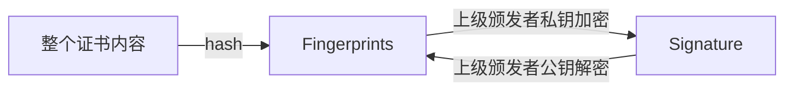
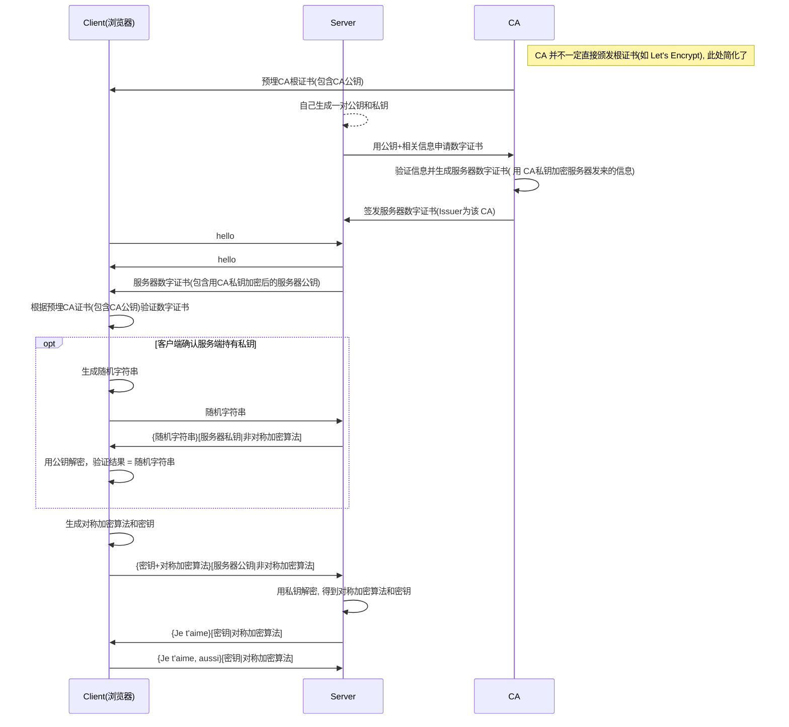

# HTTPS

## TL;DR

* 先用非对称加密换密钥, 再用对称加密传输
* 在 TCP 和 HTTP 之间增加了加密(TLS/SSL)层
  * TLS: Transport Layer Security(传输层安全协议)
  * SSL: TLS 的前身

## 加密算法

* 非对称加密算法: 通过一把密钥加密的内容可以并且只能由与之配对的另一把密钥能够解密, 比如 RSA, ECDSA
  * 非对称加密性能很低, 所以一般只在第一次握手时使用，通过握手交换对称加密密钥，在之后的通信走对称加密。
* 对称加密算法: AES，RC4，3DES
* HASH算法(不可逆): MD5, SHA1, SHA256
  * 王小云2004年的的[论文](https://eprint.iacr.org/2004/199.pdf) 说明了 MD5, SHA 被[碰撞](https://dablelv.blog.csdn.net/article/details/87938911)(f(M1)=f(M2), 可以找到 M2)的方法, 2004年的论文2017年以后网上出现了更大规模的讨论估计是因为算力的增长吧
  * 2017 年谷歌宣布[实现](https://www.zhihu.com/question/56234281)了 SHA-1 碰撞, 但是是基于很大的算力成本的

## 流程

* CA(Certificate Authority, 数字证书认证机构) 是负责发放和管理数字证书的权威机构
  * Root CA: 颁发根证书, 如 `DST Root CA X3`
  * Intermediate CA: 基于某个根证书颁发自己的证书, 如 `Let's Encrypt`

* 数字证书(Certificate)基本构成
  * Subject (所有人) 如 pbdm.cc
    * Common Name
  * Issuer (上级证书的发布机构), 如 Let's Encrypt(根证书的 Subject 和 Issuer 是一样的, 所以 Let's Encrypt 颁发的并不是根证书)
  * Valid from , Valid to (证书的有效期)
  * Public key (**所有人**公钥) 非对称加密算法的公钥
  * Signature (数字签名), 指纹的加密(使用**上级颁发者**的私钥)结果就是数字签名
  * Signature algorithm (数字签名算法) 一种对称加密算法, 如 RSA
  * Fingerprints (指纹), 用来保证证书的完整性
  * Fingerprints algorithm(指纹算法), 一种 不可逆的 hash 算法, 如 SHA-256
* 证书的签名是由上级颁发者的私钥加密的
* 如果用上级颁发者的公钥解密成功，说明该证书的确是用 CA 的私钥加密的，可以认为被验证方是可信的
* SAN扩展: Subject Alternative Name
  * 带有 SAN 扩展的证书可以指定更多的域名
  * 从 chrome 58 开始，自签证书就只认 SAN 不认 CommonName
* 数字证书分类
  * DV（Domain Validation）面向个人用户, 支持单域名,多域名
  * OV（Organization Validation)面向企业用户, 支持所有单域名,多域名,泛域名(*.XXX.com),多泛域名
  * EV（Extended Validation）需要公司提供金融机构的开户许可证, 支持单域名,多域名

注意: **证书里的公钥私钥和服务器里的公钥和私钥不是一个东西**



数字证书链示意


非完整简单流程图:



> [HTTPS 那些协议：TLS, SSL, SNI, ALPN, NPN by Harttle](http://harttle.land/2018/03/25/https-protocols.html)
>
> [数字证书原理](http://www.cnblogs.com/JeffreySun/archive/2010/06/24/1627247.html)
>
> [数字签名是什么 by ruanyifeng](http://www.ruanyifeng.com/blog/2011/08/what_is_a_digital_signature.html)

## 证书生成

* 私钥无法导出公钥，之所以“可以”，是因为私钥文件里面顺便保存了公钥信息

* PEM: Privacy Enhanced Mail: 一种编码格式
* .key 密钥文件
* .csr 证书请求(certificate signing request)
* .crt 证书文件
* .srl 生成证书的序列号

```shell
# 不要过分关心后缀名, .pem 或者 .key .csr .crt 都是可以的
# 这里只是简单的演示, 不包含生成带 SAN 扩展的证书
# 生成 CA 密钥(包含私钥,公钥)
openssl genrsa -out ca.pem 2048
# X.509 Certificate Signing Request (CSR) Management.(生成证书请求)
openssl req -new -key ca.pem -out ca.csr
# X.509 Certificate Data Management.(生成 CA证书)
openssl x509 -req -in ca.csr -signkey ca.pem -out ca.crt

# 生成服务器端密钥(包含私钥,公钥)
openssl genrsa -out server.pem 2048
# 服务器端需要向 CA 机构申请签名证书，在申请签名证书之前依然是创建自己的 CSR 文件
openssl req -new -key server.pem -out server.csr
# 向自己的 CA 机构申请证书，签名过程需要 CA 的证书和私钥参与，最终颁发一个带有 CA 签名的证书
openssl x509 -req -CA ca.crt -CAkey ca.pem -CAcreateserial -in server.csr -out server.crt

```

* [自签泛域名证书工具 by Fishdrowned](https://github.com/Fishdrowned/ssl)

> [What is a Pem file and how does it differ from other OpenSSL Generated Key File Formats?](https://serverfault.com/questions/9708/what-is-a-pem-file-and-how-does-it-differ-from-other-openssl-generated-key-file)
>
> [HTTPS证书生成原理和部署细节 by barretlee](https://www.barretlee.com/blog/2015/10/05/how-to-build-a-https-server/)
>
> [【译】如何在5分钟内让HTTPS在您的本地开发环境中工作](https://juejin.im/post/5a6db896518825732d7fd8e0)

## HSTS

* HTTP Strict Transport Security: HTTP 严格传输安全
* 强制用户使用 HTTPS 连接
* 用户不能忽略浏览器警告继续访问网站
* HSTS 不能保证第一次请求就是 HTTPS, 除非该域名在 HSTS Preload 列表里

> [聊聊 HSTS 下的 HTTPS 降级问题 - 小胡子哥](http://www.barretlee.com/blog/2017/04/01/hsts-downgrade/)
>
> [查看 chrome HSTS Preload 域名](chrome://net-internals/#hsts)

### SSLStrip

也叫 https 降级攻击，攻击者拦截用户流量后，欺骗用户与攻击者进行 http 通信，攻击者与服务器保持正常通信 （http 或 https），从而获取用户信息

SSLStrip 可以干掉 HSTS(用户首次访问的时候有可能是 http), 但是干不掉 HSTS Preload(这个时候用户请求永远都是 https 了)

## 其他

* Chrome 只在 TLS 上实现了 HTTP2, 因此大部分时间 HTTP2 和 HTTPS 是同时存在的
* 可以通过 [upgrade-insecure-requests](https://developer.mozilla.org/zh-CN/docs/Web/HTTP/Headers/Upgrade-Insecure-Requests)强制浏览器自动升级 HTTP 请求到 HTTPS

> [淺談 HTTP、HTTPS、HSTS 安全 MITM、SSLStrip by weils](https://weils.net/blog/2016/08/05/http-https-hsts-vs-mitm-sslstrip/)
>
> [Every byte of a TLS connection explained and reproduced](https://tls.ulfheim.net/)
