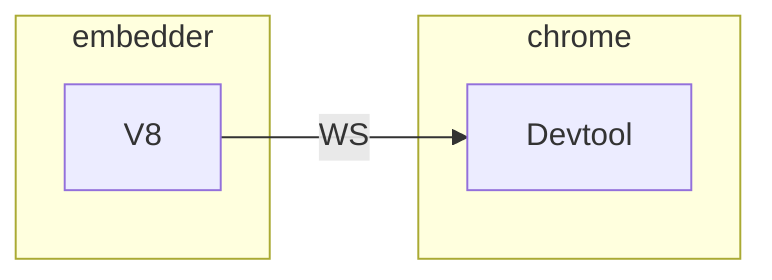

# V8-Inspector

## Chrome DevTools Protocol(CDP)

* [官网](https://chromedevtools.github.io/devtools-protocol)
  * 调试打断点相关的 API 主要在 [Debugger](https://chromedevtools.github.io/devtools-protocol/tot/Debugger)里
* 分为很多版本, latest, stable, v8-inspector(node.js 里的)
* [使用 Chrome Devtools 调试 JavaScript V8 引擎](https://gclxry.com/use-chrome-devtools-to-debug-v8-javascript/)
  * `chrome-devtools://devtools/bundled/inspector.html?ws=a.b.c.d:xxxx`: 接一个 inspector ws 协议实现调试
* [揭秘浏览器远程调试技术](https://juejin.im/entry/58072e74a0bb9f0058a137ed)
  * `sudo /Applications/Google\ Chrome.app/Contents/MacOS/Google\ Chrome --remote-debugging-port=9222`
  * 在另一个 chrome 里打开 `http://localhost:9222/`, 会进入调试界面, 在这个调试界面的调试界面的 ws 里可以看到协议内容
* [RemoteDebug](https://remotedebug.org/) 总结了市面上浏览器调试的协议(貌似17年之后没更新了?!), 可以在[这里](https://compatibility.remotedebug.org/)发现一些远程调试的协议的不同. 因此, 可以通过 proxy 的方式[调试 safari](https://github.com/RemoteDebug/remotedebug-ios-webkit-adapter)(2019-10-22: [iOS 13 暂时还没适配](https://github.com/google/ios-webkit-debug-proxy/issues/314)
* puppeteer 是基于这个弄了一套更上层的 API

## 接入方法

D8 里有一个简单的通过 JS 方法调用和接收的实现, 官方文档也有一点[介绍](https://v8.dev/docs/inspector)

* InspectorClient: 负责 JS 到 V8 的通信, 当调用 JS 里的 send 方法时, 会调用类里的 [SendInspectorMessage](https://github.com/v8/v8/blob/8.3.100/src/d8/d8.cc#L2533) 成员函数
  * 当打断点时会调用 `runMessageLoopOnPause` 和 `quitMessageLoopOnPause`
* InspectorFrontend(继承自 Channel): 负责 V8 到通信. 里面实现的 `sendResponse`, `sendNotification` 最终会调用到 [Send](https://github.com/v8/v8/blob/8.3.100/src/d8/d8.cc#L2427) 方法从而通知 JS 里的 receive 方法

* 一些历史

  * 根据这篇[文章](http://blog.joshgav.com/node/debugging/2016/02/04/Node-Debug-Architecture.html), V8 2014 年5月已经[移除](https://github.com/v8/v8/commit/33fba3b)了 Debug Agent, 并[加在](https://github.com/nodejs/node/commit/7a0cfe9)了 node实现上

  * [这里](https://idom.me/articles/848.html)介绍的使用`SetMessageHandler` 已经在 2017年2月 [移除](https://github.com/v8/v8/commit/d0d4189dc094b9d6d7750ddb3ad250f3518c2225)了

>  [V8 inspector from an embedder standpoint](https://hyperandroid.com/2020/02/12/v8-inspector-from-an-embedder-standpoint/) (文章 2017 年 4 月发表在 medium 上, 2020 年 2月被作者放回了自己的 blog)

