# V8-Inspector

## [Chrome DevTools Protocol(CDP)](https://chromedevtools.github.io/devtools-protocol)

* 调试打断点相关的 API 主要在 [Debugger](https://chromedevtools.github.io/devtools-protocol/tot/Debugger)里

* 分为很多版本, latest, stable, v8-inspector(node.js 里的)
* 打开一个可以用外部调试界面调试的 Chrome
  * `sudo /Applications/Google\ Chrome.app/Contents/MacOS/Google\ Chrome --remote-debugging-port=9222`
  * 在另一个 chrome 里打开 `http://localhost:9222/`, 会进入调试界面, 在这个调试界面的调试界面的 ws 里可以看到协议内容
* [RemoteDebug](https://remotedebug.org/) 总结了市面上浏览器调试的协议(貌似17年之后没更新了?!), 可以在[这里](https://compatibility.remotedebug.org/)发现一些远程调试的协议的不同. 因此, 可以通过 proxy 的方式[调试 safari](https://github.com/RemoteDebug/remotedebug-ios-webkit-adapter)(2019-10-22: [iOS 13 暂时还没适配](https://github.com/google/ios-webkit-debug-proxy/issues/314))
* puppeteer 是基于这个弄了一套更上层的 API

V8 回应 DevTools 的消息会用 ID 区分

## D8里的例子

只是一个[简单的通过 JS 方法调用和接收的实现](https://v8.dev/docs/inspector). 

* JS 里的 send 方法相当于 DevTool 向 V8 发消息, receive 方法相当于 V8 调用 Devtool. 

* InspectorClient: 负责 JS 到 V8 的通信,  JS 发送消息时, 会调用 [InspectorClient::SendInspectorMessage](https://github.com/v8/v8/blob/8.3.100/src/d8/d8.cc#L2533) 从而[通知 InspectorSession](https://github.com/v8/v8/blob/8.3.100/src/d8/d8.cc#L2548).
  * 断点调试: 当触发断点时就调用 `runMessageLoopOnPause`, 这时需要加锁阻塞线程, 并同时继续处理消息, 直到`quitMessageLoopOnPause` 被触发恢复线程
* InspectorFrontend(继承自 Channel): 负责 V8 到 JS 通信. 里面实现的主要方法是: 
  *  `sendResponse`: 当回复 JS 消息时调用, 回应的 JSON 里会匹配 JS 发给 V8 消息的 id
  *  `sendNotification` : 当单独发通知时调用, 如 `Runtime.executionContextCreated`, `Debugger.scriptParsed`
  * 最终这两个方法会调用到 [InspectorFrontend::Send](https://github.com/v8/v8/blob/8.3.100/src/d8/d8.cc#L2427) 从而通知 JS 里的 receive 方法

## 简单接入

```mermaid
sequenceDiagram
 participant Devtool
 participant InspectorClient
 participant InspectorSession
 participant InspectorChannel
 Devtool-->>InspectorClient: sendmessage
 InspectorClient-->>InspectorSession: dispatchProtocolMessage
 InspectorChannel-->>Devtool: sendResponse
 InspectorChannel-->>Devtool: sendNotification
```

* [这里](https://github.com/pbdm/playground/tree/master/cpp/v8/v8-inspector)有一个借鉴[ahmadov/v8_inspector_example](https://github.com/ahmadov/v8_inspector_example) 的实现
* 如果需要在 `chrome://inspect` 里找到链接, 需要[用 http 实现 ` /json` 和  ` /json/version` 的数据](https://zhuanlan.zhihu.com/p/74693078)
* Chrome 内置的DevTools 地址: `chrome-devtools://devtools/bundled/inspector.html?v8only=true&ws=a.b.c.d:xxxx`

## 一些历史

* 根据这篇[文章](http://blog.joshgav.com/node/debugging/2016/02/04/Node-Debug-Architecture.html), V8 2014年5月已经[移除](https://github.com/v8/v8/commit/33fba3b)了 Debug Agent, 并[加在](https://github.com/nodejs/node/commit/7a0cfe9)了 node实现上

* [这里](https://idom.me/articles/848.html)介绍的使用`SetMessageHandler` 已经在 2017年2月 [移除](https://github.com/v8/v8/commit/d0d4189dc094b9d6d7750ddb3ad250f3518c2225)了

>  [V8 inspector from an embedder standpoint](https://hyperandroid.com/2020/02/12/v8-inspector-from-an-embedder-standpoint/) (文章 2017 年 4 月发表在 medium 上, 2020 年 2月被作者放回了自己的 blog)
>
> [使用 Chrome Devtools 调试 JavaScript V8 引擎 by gclxry](https://gclxry.com/use-chrome-devtools-to-debug-v8-javascript/)
>
> [揭秘浏览器远程调试技术 by Taobao FED](https://juejin.im/entry/58072e74a0bb9f0058a137ed)
>
> v8从入门到入土: 调试篇 by 冰河[一](https://zhuanlan.zhihu.com/p/67191152), [二](https://zhuanlan.zhihu.com/p/74693078), [三](https://zhuanlan.zhihu.com/p/74694199)

