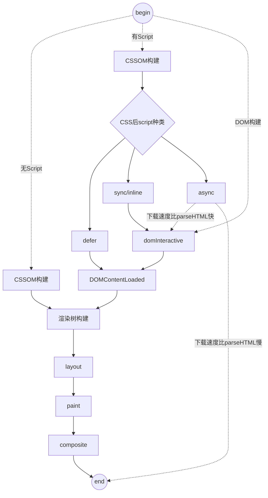

# 浏览器原理

## 关键渲染路径

* 浏览器会 "偷看" DOM, 预先下载相关外联资源(CSS, JS)
* 当 HTML 解析器遇到一个 Script 标记时, 它会暂停构建 DOM, 将控制权移交给 JavaScript 引擎. 等 JavaScript 引擎运行完毕, 浏览器会从中断的地方恢复 DOM 构建
  * JS(sync, inline) 在何处插入, 就在何处执行
* CSSOM 构建不会阻塞 DOM, 但会因为阻塞后续的 JS 而阻塞 DOM 从而阻塞 domContentLoaded
  * CSSOM 构建会阻塞之后的 JS 执行, 因为 JS 会查询或者计算任何对象的 Style
  * 从 [Chrome 69](https://twitter.com/patmeenan/status/1037027969842208777)开始, body 内的 CSS 已经[不再阻塞整个页面的渲染](https://docs.google.com/presentation/d/1D4foHkE0VQdhcA5_hiesl8JhEGeTDRrQR4gipfJ8z7Y/present?slide=id.g1d760124ab_0_6), [这里](https://jakearchibald.com/2016/link-in-body/) 有 Jake Archibald 的详细解释(其实 Firefox 很早就支持了)
* [为达到更好的用户体验, 浏览器可以在不断接收和处理来自网络的其余内容的同时将部分内容解析并显示出来](https://stackoverflow.com/questions/34289535/why-first-paint-is-happening-before-domcontentloaded)
  * 不是每次 DOM 构建后都需要 paint (如果啥都没变为啥要呢..)
  * 有可能在 DOMContentLoaded 前先 paint 过部分 DOM
  * 当渲染时间远小于 script 下载时间, 且所有 script 都下载完了, 浏览器会选择先 paint 出已经 parse 的部分
    * 机器性能好的时候(pc)
    * script 下载很慢的时候(不在本地)

* DOM 树构建: DevTools 里的 Parse HTML
* CSSOM 树构建: DevTools 里的 Recalculate Style 表示捕获解析和 CSSOM 树构建以及样式计算
* DOM 树与 CSSOM 树合并后形成渲染树(Render Tree): DevTools 里的 Layout 表示捕获渲染树构建以及位置和尺寸计算
  * 不可见的节点不会出现在渲染树中

## Script 的 async 和 defer 属性

* 可以在[这里](https://html.spec.whatwg.org/multipage/scripting.html#attr-script-defer)找到相关的标准
* `document.createElement` 添加的 Script 默认是 async 的
* 使用 async 标签可以使 JS 在**下载过程**中不阻塞 DOM 构建
* 使用 defer 可以在 async 的基础上即使 JS 下载完成了也不阻塞 DOM 构建
* 多个 defer 脚本会需要按照在页面中的顺序执行
* 多个 async 脚本按照下载完成顺序执行
* `domInteractive` 代表 DOM 树构建完成, 而 `domContentLoaded` 则需要把同步, defer 的脚本都执行完才会触发. [标准](https://html.spec.whatwg.org/multipage/parsing.html#the-end)里指出了他们的区别, 因此:
  * 使用 defer 标签不会阻塞 `domInteractive`, **但会阻塞 domContentLoaded**
  * 使用 async 标签**除非下载时间特别短**才会阻塞 `domInteractive` 与 `domContentLoaded`(但是时间已经这么短了, 大概率也不会有什么影响了吧...)

## 阻塞路径

## 像素管道(pixel pipeline)

当用浏览器绘制的过程由以下5个步骤组成(如果是第一次加载的话当然还需要 Parse HTML)

* Javascript: JS操作
* Style: 样式计算
* Layout: 布局, 排版, 在Firefox 中叫 reflow
* Paint 绘制
* Composite 合成
  * 将页面的已绘制部分放在一起以在屏幕上显示的过程

### 触发规律

我们可以在 [CSS Triggers](https://csstriggers.com/) 查询修改哪些属性会触发 paint, layout 和 Compoiste(从表上来看 Firefox 很牛逼啊). [这里](https://gist.github.com/pvolyntsev/cdade177ded110e2ad97)简要的罗列了那些方法会导致重排. 总结下来有一下几点

* 通常对**几何属性**(width, height, left, top...) 的更改会触发 Layout
* 除 transform 或 opacity 属性之外, 更改任何属性始终都会触发 Paint
* 有的时候浏览器会收集 reflow 操作到缓存队列中直到一定的规模或者过了特定的时间, 再一次性地flush 队列. 因此当读取布局信息时 (如`getComputedStyle()`)有时也会导致 reflow

## Chrome 进程模型

* 一般来说, Chrome 里进程分两类
  * 主进程(browser process)
  * 每个 tab 或者扩展为独立进程(renderer processes), 可以在 Activity Monitor 里看到一个 Google Chrome Helper
* 线程
  * GUI
    * GUI渲染线程负责渲染浏览器界面(repaint, reflow), 与JavaScript引擎互斥, 当JavaScript引擎执行时GUI线程会被挂起, GUI 更新会被保存在一个队列中等到 JavaScript 引擎空闲时立即被执行
  * JS 引擎
  * Web Worker
  * Script Streaming
  * 定时器(负责将 setTimeout 里面的语句塞到 queue 里去的任务也是在单独的线程里执行的(里面的语句还是要在 js 引擎所在的线程执行的)
  * 事件触发
  * 网络请求(貌似是主进程里的线程?!)

> [Deciphering the Critical Rendering Path(关键渲染路径) by Ilya Grigorik](https://calendar.perfplanet.com/2012/deciphering-the-critical-rendering-path/)
>
> [浏览器的工作原理 by Tali Garsiel and Paul Irish](https://www.html5rocks.com/zh/tutorials/internals/howbrowserswork/#The_main_flow)
>
> LIFE OF A pixel by Steve Kobes: [video](https://drive.google.com/file/d/1Ky59m-F79ULs4ydMbD4Mp1dBXvs_eDes/view) / [slide](https://docs.google.com/presentation/d/1boPxbgNrTU0ddsc144rcXayGA_WF53k96imRH8Mp34Y/edit#slide=id.p)
>
> [从浏览器多进程到JS单线程，JS运行机制最全面的一次梳理 by dailc](http://www.dailichun.com/2018/01/21/js_singlethread_eventloop.html)
