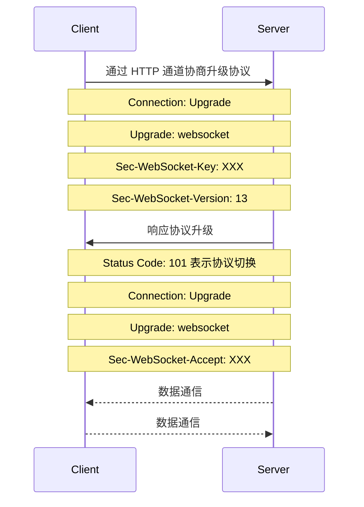

# WebSocket

## 协议内容

* 全双工通道，可以双向通信, 适合 IM
* 基于 TCP
* 握手阶段采用 HTTP 协议
* 握手后交换数据时不需要像 HTTP 轮询那样携带完整的头部了
* 协议标准可以再 [IETF](https://tools.ietf.org/html/rfc6455) 网站上找到

## Node.js 实现

* [ws](https://github.com/websockets/ws)
* [socket.io](https://socket.io/)

## Misc

* Servers MAY close the WebSocket connection whenever desired.  Clients **SHOULD NOT** close the WebSocket connection arbitrarily](https://tools.ietf.org/html/rfc6455#section-7.3)

> [WebSocket协议：5分钟从入门到精通 by 程序猿小卡](https://www.cnblogs.com/chyingp/p/websocket-deep-in.html)

