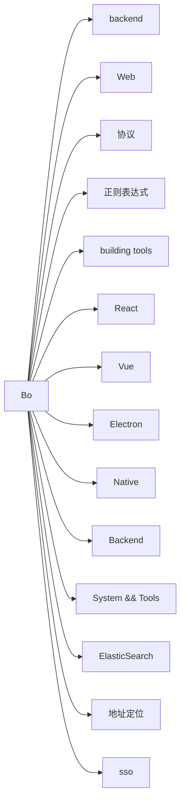

# 琥珀草

好记性不如更好的键盘。

折腾来折腾去，最后还是选回了自己写的小框架, 以我这种更新频率，还是不适合以博客的形式写东西。感觉还是 WIKI 的方式更适合做知识的积累。

侧边栏有很多空链接，先把坑占了，慢慢填吧, D.R.Y.!!!

```mermaid
graph LR
Bo --> backend
Bo --> Web
Bo --> 协议
Bo --> 正则表达式
Bo --> id1[building tools]
Bo --> React
Bo --> Vue
Bo --> Electron
Bo --> Native
Bo --> Backend
Bo --> id2[System && Tools]
Bo --> ElasticSearch
Bo --> 地址定位
Bo --> sso

```
