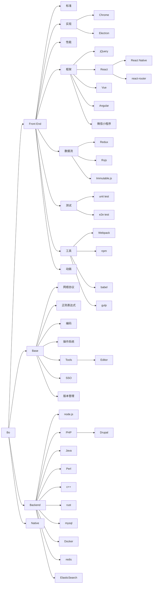

# 琥珀草

The palest ink is better than the best memory, keep [D.R.Y](https://en.wikipedia.org/wiki/Don%27t_repeat_yourself) ...

```mermaid
graph LR
Bo --> FE[Front End]
Bo --> Base
Bo --> Backend
Bo --> Native
FE --> 标准
FE --> 实现
实现 --> Chrome
实现 --> Electron
FE --> 性能
FE --> 框架
框架 --> jQuery
框架 --> React
React --> RN[React Native]
React --> react-router
框架 --> Vue
框架 --> Angular
框架 --> 微信小程序
FE --> 数据流
数据流 --> Redux
数据流 --> Rxjs
数据流 --> Immutable.js
FE --> 测试
测试 --> utest[unit test]
测试 --> etest[e2e test]
FE --> 工具
工具 --> Webpack
工具 --> npm
工具 --> babel
工具 --> gulp
FE --> 动画

Base --> 网络协议
Base --> 正则表达式
Base --> 编码
Base --> 操作系统
Base --> Tools
Tools --> Editor
Base --> SSO
Base --> 版本管理

Backend --> node.js
Backend --> PHP
PHP --> Drupal
Backend --> Java
Backend --> Perl
Backend --> c++
Backend --> rust
Backend --> mysql
Backend --> Docker
Backend --> redis
Backend --> ElasticSearch


```
