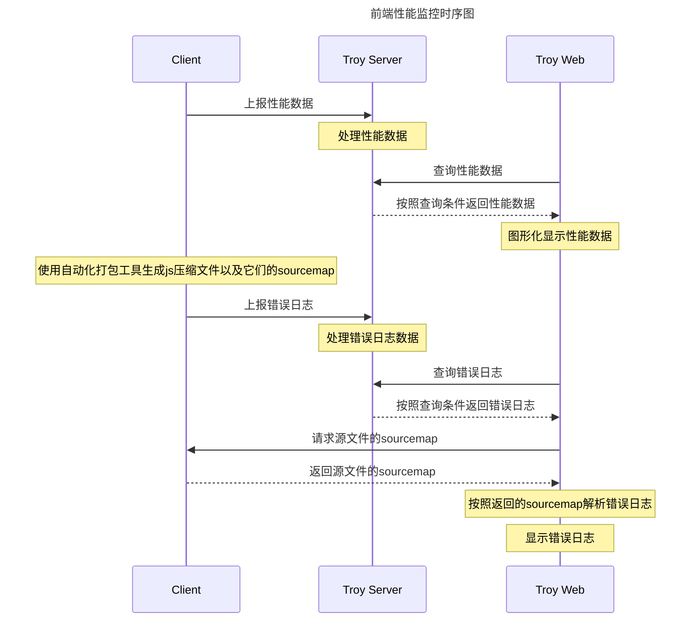

# 前端日志收集

## 目的

好的产品必须有好的日志监控体系,这样才能很好的得到用户的反馈从而不断的迭代改进我们的产品

通过性能监控发现部分前端性能瓶颈，以便进行优化；通过错误日志收集，及时获得前端的运行时错误。

## 性能数据收集

总结的需要取到的数据点如下:

* 客户端点击进入 webview

两种统计方式, 一种是客户端直接发打点给服务端,另一种是将时间戳传给 web 端. 这里我们选择由客户端直接将时间戳传给 web 端. 关于如何传给 web 端, 通常能想到的是 cookie, url, schema 三种方式, 我们选择通过 schema 来传输,并且以后更多的客户端和 web 端之间的交互都可以用 schema 来传输

* 白屏时间：

用户从打开页面开始到页面开始有东西呈现为止，这过程中占用的时间就是白屏时间
在 react 里这个时间应该是和用户可操作时间相近, 因为外部 js 引用会放在 body 底部而不是 head 底部, 且 DOM 是由 js 渲染的.

```javascript
<!DOCTYPE HTML>
<html>
  <head>
    <script>
      window.domAfterLoading = +new Date
    </script>
    <script src="troy.js"></script>
    <script>
      var troy = new Troy();
      troy.init();
    </script>
    <script>
      // head里所有的 script 都下载完后才会执行
      troy.makeLog('head end');
    </script>
  </head>
  <body>
    <div id='app'></div>
  </body>
  <script src="react.js"></script>
  <script>
    troy.makeLog('html end');
  </script>
</html>
```

* 首屏时间

用户浏览器首屏内所有内容都呈现出来所花费的时间
需要绑定所有图片的 load 事件, 判断图片是否在首屏显示, 取 load 最晚的值

(应该为用户从打开页面开始到页面开始呈现有意义的内容为止(Meaningful Paint)，这过程中占用的时间就是白屏时间。因为有意义的内容只能通过人来定义，所以一般计算白屏时间的办法为通过第三方工具截取每0.1秒的截图，根据截图来确定白屏的时间。不同的业务团队，可以自行指定重要的元素挂载(Mount)的时间，来确定Meaningful Paint发生的时间。可以根据首屏图片加载出的时间来预估。)

* 用户可操作时间：用户可以进行正常的点击、输入等操作

```javascript
  document.addEventListener('DOMContentLoaded', function() {
    // make log here
  })
```

* 页面总下载时间：页面所有资源(非异步)都加载完成并呈现出来所花的时间，即页面 onload 的时间

```javascript
  window.addEventListener('load', function() {
    // make log here
  })
```

> [baidu fex](http://fex.baidu.com/blog/2014/05/build-performance-monitor-in-7-days/)

* 按照不同项目的业务逻辑, 可以收集某些接口的请求完成时间, 组件加载完成时间

* android高版本平台可以使用 `performance.timing`, 示例如下

```javascript
  var t = performance.timing;
  var times = {};
  // onLoad时间
  times.loadPage = t.loadEventEnd - t.navigationStart;

  // html 页面渲染时间
  times.processHtml = t.domInteractive - t.domLoading;

  // 等待开始渲染时间
  times.waitForProcess = t.domInteractive - t.navigationStart;

  // 解析 DOM 树结构的时间
  times.domReady = t.domComplete - t.responseEnd;

  // 重定向的时间
  times.redirect = t.redirectEnd - t.redirectStart;

  // DNS 查询时间
  times.lookupDomain = t.domainLookupEnd - t.domainLookupStart;

  // 内容加载完成的时间
  times.request = t.responseEnd - t.requestStart;

  // 执行 onload 回调函数的时间
  times.loadEvent = t.loadEventEnd - t.loadEventStart;

  // DNS 缓存时间
  times.appCache = t.domainLookupStart - t.fetchStart;

  // 卸载页面的时间
  times.unloadEvent = t.unloadEventEnd - t.unloadEventStart;

  // TCP 建立连接完成握手的时间
  times.connect = t.connectEnd - t.connectStart;
```


> [caniuse](http://caniuse.com/#search=timing)
>
> [alloyteam](http://www.alloyteam.com/2015/09/explore-performance/)

* 第三方工具

> [gtmetrix](https://gtmetrix.com/)
>
> [mmtrix](http://www.mmtrix.com/)

* 其他注意事项

跳转 url 后记得要置零应该按照不同的需求考虑将计时器清零
运维需要监控接口返回时间
样本量庞大,我们并不需要收集所有的信息,收集的时候需要过滤

## 错误日志上报

错误日志上报有两种方法

### try catch

* 无法捕捉到语法错误，只能捕捉运行时错误
* 可以拿到出错的信息，堆栈，出错的文件、行号、列号
* 需要借助工具把所有的function块以及文件块加入try,catch，可以在这个阶段打入更多的静态信息
* 异步方法如果要支持try catch需要重写

### window.onerror

* 可以捕捉语法错误，也可以捕捉运行时错误
* 可以拿到出错的信息，堆栈，出错的文件、行号、列号
* 只要在当前页面执行的js脚本出错都会捕捉到，例如：浏览器插件的javascript、或者flash抛出的异常等
* 跨域的资源需要特殊头部支持
* 早期safari版本（ios6, 7）里上报不全, 没有 column, errorObject, 部分烂的安卓机型也有类似问题

> [pajk](http://doc.pajk-ent.com/pages/viewpage.action?pageId=24117480)
>
> [前端代码异常日志收集与监控 - 小胡子哥](http://www.cnblogs.com/hustskyking/p/fe-monitor.html)
>
> [sentry](https://getsentry.com/welcome/)
>
> [Capture and report JavaScript errors with window.onerror -  Ben Vinegar](https://blog.sentry.io/2016/01/04/client-javascript-reporting-window-onerror.html)
>
> [How to catch JavaScript Errors with window.onerror (even on Chrome and Firefox) - danlimerick](https://danlimerick.wordpress.com/2014/01/18/how-to-catch-javascript-errors-with-window-onerror-even-on-chrome-and-firefox/)
>
> [前端代码异常监控 - 拉风](http://rapheal.sinaapp.com/2014/11/06/javascript-error-monitor/)
>
> [前端性能监控方案调研 - ihardcoder](http://www.cnblogs.com/ihardcoder/p/5312011.html)
>
> [前端异常监控系统的落地 - 小爝的日常](https://zhuanlan.zhihu.com/p/26085642?group_id=830747679029084160)

这里我们暂时选择 window.onerror 来收集数据, 避免过多的侵入式代码实现

## 日志上报

* 基于Troy系统

> [pajk](http://doc.pajk-ent.com/pages/viewpage.action?pageId=28870690)

* 上报数据结构(暂定)

```javascript
  {
    appName: '应用名',
    logMessage: '报错信息或者性能字段',
    logTime: '上报时间',
    perfData: '性能指标',
    type: '上报类型(性能指标或者错误日志)',
    errorCol: '错误日志行数',
    errorLine: '错误日志列数',
    errorUrl: '错误日志url',
    userAgent: '机型和版本(可由服务端提供？！)'
    ip: '(可由服务端提供？！)'
  }
```

* 数据分析

## 图形化后台

采用[ant.design](http://ant.design/)与[recharts](http://recharts.org/)结合

## 聚合方式需求

* 获取一段时间内某个指定字段的统计数(done)
* 获取一段时间内某个指定字段的平均值(done)

* [JavaScirpt 常见报错信息](http://jinlong.github.io/2015/02/01/javascript-errors-and-how-to-fix-them/)



-----

2018-06-07

* [fundebug](https://www.fundebug.com/) 这个可以研究下
